# DSO202 — Assignment 2: Extending the Task Tracker with Unit II Concepts

**Namespace:** `dso202-assignment-01` (reused from Assignment 1)
**Cluster:** `kind` (`dso202` — 1 control-plane node, 2 worker nodes, Kubernetes v1.36.1)

Assignment 2 takes the three-tier Task Tracker deployed in Assignment 1 and rebuilds parts of it using Unit II concepts: StatefulSets, Ingress, RBAC beyond a single namespace, and Operators. The three tier images and the application code are unchanged. The graded effort is again the Kubernetes configuration.

---

## 1. What Changed from Assignment 1

| Area | Assignment 1 | Assignment 2 |
| --- | --- | --- |
| Database workload | `Deployment` + standalone `PersistentVolumeClaim` | Stage 1: `StatefulSet` with a `volumeClaimTemplate`. Stage 2: CloudNativePG `Cluster` (2 instances, streaming replication) |
| External access | Frontend `NodePort` (30080); backend unreachable from a browser | `Ingress` in front of both tiers; frontend and backend are both `ClusterIP` |
| Transport security | None | Self-signed TLS termination, name-based virtual hosts |
| RBAC | One namespaced `Role` and `RoleBinding` | Aggregated `ClusterRole`, `ClusterRoleBinding`, and a Pod authenticating with a ServiceAccount token |
| `DB_HOST` | `db-svc` | `tasks-pg-rw` |
| `BACKEND_URL` | `http://backend-svc:8080` | `http://localhost:30080` |

---

## 2. Repository Structure

```
assignment-2/
├── README.md
├── kind-cluster.yaml
├── namespace.yaml
├── common-manifests/
│   ├── configmap.yaml
│   ├── secret.yaml
│   └── quota.yaml
├── database/
│   ├── statefulset.yaml        # stage 1 (replaces deployment.yaml and pvc.yaml)
│   └── service.yaml            # headless Service, unchanged
├── operator/
│   └── cluster.yaml            # stage 2: CloudNativePG Cluster
├── backend/
│   ├── deployment.yaml
│   └── service.yaml
├── frontend/
│   ├── deployment.yaml
│   └── service.yaml            # now ClusterIP
├── ingress/
│   ├── ingress.yaml            # path-based routing
│   └── ingress-tls.yaml        # TLS + name-based virtual hosts + annotation
├── rbac/
│   ├── rbac.yaml               # Assignment 1 namespaced Role (kept)
│   ├── clusterrbac.yaml        # aggregated ClusterRole, ClusterRoleBinding, ServiceAccount
│   └── sa-demo-pod.yaml        # temporary Pod used to demonstrate SA authentication
├── tls/                        # git-ignored: private key and certificate
└── evidence/                   # screenshots (see Section 9)
```

The `tls/` folder is listed in `.gitignore`. The TLS Secret was created imperatively (`kubectl create secret tls`), so the private key never appears in a committed manifest.

---

## 3. Request Flow

```
Browser ── http://localhost:30080 ──▶ kind control-plane container (host port 30080)
                                          │
                                          ▼
                              ingress-nginx controller (NodePort 30080 → 80)
                                          │
                     ┌────────────────────┴───────────────────┐
                  path /                                 path /api
                     ▼                                        ▼
               frontend-svc (ClusterIP)               backend-svc (ClusterIP)
                                                              │
                                                              ▼
                                                    tasks-pg-rw (ClusterIP)
                                                              │
                                              ┌───────────────┴──────────────┐
                                        tasks-pg-2 (primary)  ⇄  tasks-pg-1 (replica)
```

Nothing except the ingress controller is exposed outside the cluster, which satisfies the Assignment 1 rule that the backend and database are never exposed via NodePort or LoadBalancer.

---

## 4. Unit 2.1 — StatefulSets

### Use case

PostgreSQL needs a stable identity and its own storage per replica. A Deployment gives random Pod names and shares one hand-made PVC, so the database tier is the natural StatefulSet candidate.

### Implementation (`database/statefulset.yaml`)

The Assignment 1 Deployment and PVC were deleted and replaced with a single `StatefulSet` named `db-statefulset`. Differences from the Deployment:

- `serviceName: db-svc` ties it to the existing headless Service, which is what gives each Pod a stable DNS name. `database/service.yaml` was not changed.
- `volumeClaimTemplates` replaces the standalone `pvc.yaml`. Kubernetes creates one PVC per replica, named `<template>-<pod>` (here `db-storage-db-statefulset-0`), using kind's default `standard` StorageClass.
- The Pod is named `db-statefulset-0` instead of a random hash suffix.

### Verification

| Concept | What was shown |
| --- | --- |
| Stable Pod name and per-replica PVC (2.1.2, 2.1.4) | `kubectl get statefulset,pods,pvc` showed `db-statefulset-0` and the auto-created `db-storage-db-statefulset-0`, `Bound` |
| Stable network identity (2.1.2.1, 2.1.3) | From the backend Pod, `nslookup db-statefulset-0.db-svc.dso202-assignment-01.svc.cluster.local` resolved to `10.244.2.6`. The name is tied to replica index 0, not to a Pod IP |
| Ordered scale-up (2.1.2.2) | Scaling to 3 replicas: `db-statefulset-1` reached `Running` before `db-statefulset-2` even appeared as `Pending` |
| Reverse-order scale-down (2.1.2.2) | Scaling back to 1: `db-statefulset-2` finished terminating before `db-statefulset-1` began |
| Storage outlives Pods (2.1.4) | After scaling down, all three PVCs (`-0`, `-1`, `-2`) were still `Bound`. StatefulSets do not delete storage on scale-down. The two orphaned PVCs were deleted manually afterwards |

### Caveats

- The tutor's database image has no replication logic. Replicas `-1` and `-2` each started an independent, empty PostgreSQL with their own PVC. The scale test demonstrates StatefulSet mechanics only, not a replicated database. Real replication comes in Section 7.
- **This was a fresh start, not a data migration.** Deleting the Assignment 1 PVC destroyed its data. The StatefulSet's database started from the image's seed data only, so the UI showed the three seed tasks and the first task created afterwards got id 4.

---

## 5. Unit 2.2 — Ingress

### 5.1 Ingress controller (2.2.2.1)

An `ingress-nginx` controller was already installed in the cluster before this assignment. Applying the kind-flavoured manifest again reported almost everything as `unchanged`, so it was reused rather than reinstalled. Two problems had to be solved for it to be reachable from the host:

- Its Service was type `LoadBalancer` and stayed at `<pending>` forever, because kind has no cloud load balancer.
- The cluster's only host port mapping is `30080` on the control-plane container (from `kind-cluster.yaml`), while the controller Pod was scheduled on `dso202-worker2`.

The fix was to patch the controller's Service to `NodePort` with the HTTP node port set to `30080`, and `externalTrafficPolicy: Cluster` so traffic arriving at the control-plane node is forwarded to the Pod on another node. The frontend Service was first changed to `ClusterIP` to free port `30080`. This works because the Ingress makes the frontend's own NodePort unnecessary.

`curl http://localhost:30080` returned an nginx `404` before any Ingress existed, which confirmed the path from host to controller was working.

**Note:** the upstream Kubernetes project announced the retirement of ingress-nginx, with maintenance ending in March 2026 and no further releases or security fixes afterwards. Existing installations keep working, which is why it remains fine for this exercise, but it would not be a sensible choice for a new production deployment. The Kubernetes project recommends Gateway API or another controller (see <https://kubernetes.io/blog/2025/11/11/ingress-nginx-retirement/>).

### 5.2 Basic routing rules (2.2.1.1) — `ingress/ingress.yaml`

| Path | Backend |
| --- | --- |
| `/api` | `backend-svc:8080` |
| `/` | `frontend-svc:8080` |

Both routes were tested through the single entry point: `/` returned the frontend HTML (`200`) and `/api/status` returned `{"status":"ok","db":"connected"}`. The backend is now reachable from outside the cluster without ever being exposed as a NodePort.

### 5.3 Fixing the browser-side backend URL

Assignment 1 documented that the UI showed "Backend unreachable", because `BACKEND_URL` was a cluster-internal name (`backend-svc`) that a browser cannot resolve. The frontend renders `BACKEND_URL` into `config.js` once at container start, which was confirmed by fetching `/config.js`.

Because the Ingress puts frontend and backend on the same origin, `BACKEND_URL` was changed to `http://localhost:30080` in the ConfigMap and the frontend Deployment was restarted (`kubectl rollout restart`), since a running container does not re-read its ConfigMap. The UI then showed "BACKEND + DB ONLINE". A task was created through the form and another had its status changed from the browser, so the full path (Ingress, backend, database) works from a browser.

### 5.4 TLS termination and name-based virtual hosting (2.2.1.2, 2.2.1.3) — `ingress/ingress-tls.yaml`

A self-signed certificate was generated with OpenSSL:

```bash
openssl req -x509 -nodes -newkey rsa:2048 -days 365 \
  -keyout tls/tls.key -out tls/tls.crt \
  -subj "/CN=tasktracker.local/O=DSO202" \
  -addext "subjectAltName=DNS:tasktracker.local,DNS:api.tasktracker.local"
kubectl create secret tls tasktracker-tls --cert=tls/tls.crt --key=tls/tls.key -n dso202-assignment-01
```

A second Ingress, `tasktracker-tls-ingress`, references the `tasktracker-tls` Secret and defines two hosts:

| Host | Backend |
| --- | --- |
| `tasktracker.local` | `frontend-svc:8080` |
| `api.tasktracker.local` | `backend-svc:8080` |

Only HTTP is mapped to the host, so HTTPS was tested through the kind node's Docker-network IP and the controller's HTTPS NodePort (`32185`), with `curl --resolve` supplying the hostname instead of editing `/etc/hosts`. The same IP and port served the frontend for `tasktracker.local` (`HTTP/2 200`, `text/html`) and the backend JSON for `api.tasktracker.local`, chosen only by the hostname. The certificate's `subject` and `issuer` were identical (`CN=tasktracker.local; O=DSO202`), which is what identifies it as self-signed. TLS terminates at the controller; traffic from the controller to the Pods is plain HTTP.

The first Ingress has no host, so it keeps serving `localhost:30080` unchanged.

### 5.5 Annotations (2.2.3)

The annotation `nginx.ingress.kubernetes.io/limit-rps: "2"` was added to `tasktracker-tls-ingress`. Thirty rapid requests to the API host returned twelve `200`s, then `503`, then a single `200`, then `503` for the remainder. The controller allowed a short burst, rejected requests over the limit, and let one through as its allowance refilled. The limit applies only to this Ingress, so the browser UI on the first Ingress was unaffected.

### 5.6 Traefik (2.2.2.2) — written comparison only

Traefik was **not installed**. A second controller would compete for the same host ports on a single-node-mapped kind cluster without adding new evidence. The comparison:

| Aspect | NGINX Ingress Controller | Traefik |
| --- | --- | --- |
| Controller-specific configuration | Annotations on standard `Ingress` objects (as used for `limit-rps`) | Its own CRDs, notably `IngressRoute` and `Middleware`; standard Ingress is also supported |
| Rate limiting | `limit-rps` annotation | A `RateLimit` middleware attached to a route |
| Configuration model | Renders and reloads an nginx configuration | Watches the API and reconfigures itself dynamically |
| Extras | Mature, very widely deployed | Built-in dashboard; automatic certificate issuance via ACME |

The trade-off is that annotations are quick to write but are unvalidated strings specific to one controller, while CRDs are typed and validated but tie the configuration to that controller's API.

---

## 6. Unit 2.3 — RBAC

Assignment 1 covered a namespaced `Role`, `RoleBinding`, and one ServiceAccount (`readonly-viewer`). This assignment adds the cluster-wide side in `rbac/clusterrbac.yaml`.

### Aggregated ClusterRole (2.3.1)

Three component `ClusterRole`s carry the label `rbac.dso202/aggregate-to-viewer: "true"`:

| ClusterRole | Grants (get, list, watch) |
| --- | --- |
| `viewer-core` | pods, services, configmaps, persistentvolumeclaims, events |
| `viewer-workloads` | deployments, statefulsets, replicasets |
| `viewer-cluster-scoped` | nodes, namespaces (cluster-scoped, so a namespaced `Role` could never grant these) |

The parent `tasktracker-viewer` ClusterRole is written with `rules: []` and an `aggregationRule` selecting that label. Kubernetes fills in its rules automatically. `secrets` are deliberately absent from every component, and no write verbs are granted.

### Binding and ServiceAccount (2.3.2, 2.3.3.1)

A ServiceAccount `cluster-viewer` in `dso202-assignment-01` is bound to `tasktracker-viewer` by the `ClusterRoleBinding` `cluster-viewer-binding`, so the permissions apply across all namespaces.

### Permission checks (`kubectl auth can-i --as=...`)

| Check | Result |
| --- | --- |
| `cluster-viewer`: list nodes | yes |
| `cluster-viewer`: list pods in `kube-system` | yes |
| `cluster-viewer`: get secrets | no |
| `cluster-viewer`: delete pods | no |
| `readonly-viewer` (Assignment 1, namespaced only): list nodes | no |

The last row shows why ClusterRoles are needed: the namespaced account cannot reach cluster-scoped resources at all.

### Pod authentication with a ServiceAccount (2.3.3.2)

A temporary Pod `sa-demo` ran as `cluster-viewer` (`serviceAccountName`). Kubernetes mounts the ServiceAccount's credentials into every Pod at `/var/run/secrets/kubernetes.io/serviceaccount` (CA certificate, namespace and token). From inside the Pod, calls to the API server with that token returned:

| Request | Status |
| --- | --- |
| list pods in the namespace | `200` |
| list nodes | `200` |
| list secrets in the namespace | `403` |

The same identity was allowed the reads the ClusterRole grants and refused the Secrets it deliberately omits. The Pod was deleted afterwards. It carried no `tier` label on purpose: `tier: frontend` would have made `frontend-svc` route real traffic to a Pod that only runs `sleep`.

The CloudNativePG operator also created its own ServiceAccount, `Role` and `RoleBinding`, all named `tasks-pg`, for the database Pods, which is the same RBAC machinery used automatically.

---

## 7. Unit 2.4 — Operators

### Operator pattern and CRDs (2.4.1)

The CloudNativePG operator **1.30.1** was installed with a server-side apply (the CRDs are too large for a client-side apply):

```bash
kubectl apply --server-side -f \
  https://raw.githubusercontent.com/cloudnative-pg/cloudnative-pg/release-1.30/releases/cnpg-1.30.1.yaml
```

Installation registered eleven CRDs in the `postgresql.cnpg.io` group: `backups`, `clusterimagecatalogs`, `clusters`, `databaseroles`, `databases`, `failoverquorums`, `imagecatalogs`, `poolers`, `publications`, `scheduledbackups` and `subscriptions`. `Cluster` is now a resource type the API server understands, and the operator's controller (`cnpg-controller-manager` in `cnpg-system`) watches for `Cluster` objects and builds everything else itself.

### One manifest, a replicated database — `operator/cluster.yaml`

The operator Deployment and the PostgreSQL image were both pulled by hand and injected with `kind load`, because the in-cluster pull of the operator image stalled at "Pulling image" for over six minutes (see Section 8). The PostgreSQL image is `ghcr.io/cloudnative-pg/postgresql:18-minimal-trixie`, which is published for `linux/amd64`, so unlike the tutor's arm64-only images it runs natively without emulation.

The `Cluster` requests:

- `instances: 2` — one primary and one streaming replica.
- `storage.size: 1Gi` on the `standard` StorageClass.
- Explicit `resources` requests and limits, so the Pods fit the namespace's ResourceQuota and are not clamped by the LimitRange defaults.
- `bootstrap.initdb` creating database `taskdb` owned by `taskuser`, with the password taken from the Secret `tasks-pg-credentials`.
- `postInitApplicationSQL` recreating the `tasks` table.

**Schema.** A plain PostgreSQL image has no seed script, so the tutor's schema was captured from the running database with `pg_dump --schema-only` and reproduced in `postInitApplicationSQL`: the same five columns, an `id` backed by a sequence, and the `tasks_status_check` constraint limiting `status` to `pending`, `in_progress` and `done`. `\d tasks` on the new primary confirmed it matches.

**Credentials.** The username and password were copied from the existing `app-secret` into a `kubernetes.io/basic-auth` Secret with `kubectl create secret generic --from-literal=...`, so no password appears in a committed file. The username `taskuser` does appear in `cluster.yaml` as `owner`, because the operator's API requires the owner to be named there; it is an identifier, not a credential.

### What the operator created

From that single manifest the operator created: Pods `tasks-pg-1` and `tasks-pg-2`; PVCs of the same names; Services `tasks-pg-rw` (always the primary), `tasks-pg-ro` (replicas) and `tasks-pg-r` (any instance); Secrets `tasks-pg-ca`, `tasks-pg-server` and `tasks-pg-replication` for TLS between instances; and the `tasks-pg` ServiceAccount, Role and RoleBinding. The cluster reported `Cluster in healthy state`, 2 of 2 instances ready, primary `tasks-pg-1`.

### Cutting the application over

`DB_HOST` in the ConfigMap was changed from `db-svc` to `tasks-pg-rw`, and the backend was restarted. `/api/status` returned `connected`. A task created through the API appeared with the same id on both `tasks-pg-1` and `tasks-pg-2`, showing that streaming replication is working without any replication configuration being written.

### Lifecycle management: automated failover (2.4.1.2)

The primary Pod was deleted (`kubectl delete pod tasks-pg-1`). Watching the Cluster resource showed the status pass through `Failing over` and `Waiting for the instances to become active`, `PRIMARY` change from `tasks-pg-1` to `tasks-pg-2`, and the cluster return to `Cluster in healthy state`. The deleted Pod came back and rejoined as a replica (`tasks-pg-2` role `primary`, `tasks-pg-1` role `replica`). Both stored tasks were still returned by the API afterwards. Nothing was reconfigured by hand: `tasks-pg-rw` follows whichever Pod is primary.

### Comparison of the three database stages

| | Assignment 1 Deployment | Stage 1 StatefulSet | Stage 2 Operator |
| --- | --- | --- | --- |
| Pod identity | random suffix | stable ordinal name | stable names, roles tracked |
| Storage | one hand-made PVC | PVC per replica from template | PVC per instance, managed |
| Replication | none | none (replicas are independent) | streaming replica configured by the operator |
| Failure handling | Pod restart only | Pod restart only | detects failure and promotes the replica |
| Manifest size | ~60 lines across 3 files | ~40 lines | ~40 lines, more capability |

The operator adds capability, not manifest size, because the domain knowledge (replication, promotion, certificates) lives in the controller.

### Scope note (2.4.2)

A custom operator (Operator SDK, own CRD and controller) was not written. The syllabus item 2.4.3 asks for examples of popular operators, and building a controller from scratch was judged out of proportion to the rest of the assignment. The CRDs, custom resource and reconciliation behaviour of an existing operator were demonstrated instead.

---

## 8. Resource Governance Revisited (Assignment 1, Task 6)

In Assignment 1 the ResourceQuota showed `0` used because the Pods pre-dated the LimitRange, which only injects defaults at admission time. That prediction was checked at the end of this assignment:

| Resource | Used | Hard |
| --- | --- | --- |
| `requests.cpu` | 500m | 1500m |
| `requests.memory` | 896Mi | 1536Mi |
| `limits.cpu` | 1750m | 3 |
| `limits.memory` | 1792Mi | 3Gi |
| `pods` | 5 | 10 |

The figures match the arithmetic exactly. Three Pods (backend, frontend, `db-statefulset-0`) were created after the LimitRange existed and received its defaults (100m / 128Mi requests, 250m / 256Mi limits). The two operator Pods carry explicit resources (100m / 256Mi requests, 500m / 512Mi limits). For example, memory requests are 3 × 128Mi + 2 × 256Mi = 896Mi. The quota has enough headroom for a third database instance, and removing the unused StatefulSet would free further room.

---

## 9. Evidence

Screenshots are in `evidence/`, numbered in the order they were captured.

### Convert the database tier from Deployment to StatefulSet

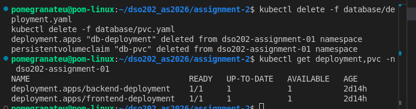

## Create the StatefulSet + headless Service for the database
**shows the StatefulSet, the pod named db-statefulset-0 (not a random hash), and the auto-created PVC.**

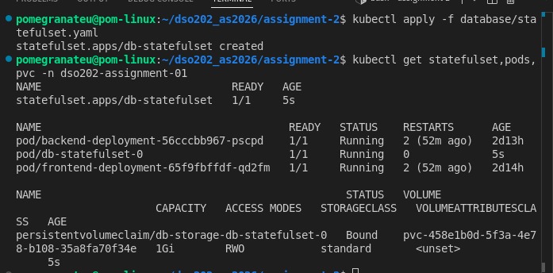

**the DNS resolution and the {"status":"ok","db":"connected"} response.**

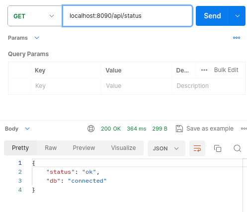

## Verify stable network identity (the actual point of a StatefulSet)
**We want to see it resolve to the pod's actual IP — that's the "stable network identity" concept (2.1.2.1) made concrete: even if this pod is deleted and recreated, it comes back as db-statefulset-0 again (not db-statefulset-<random>), so this exact DNS name keeps working.**

**Then confirm the backend can still talk to Postgres through the (unchanged) DB_HOST=db-svc — proving the app didn't need any reconfiguration despite the underlying object type changing:**

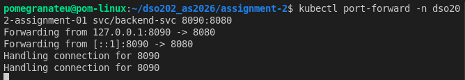

**Backend-to-Postgres connectivity confirmed working through the new StatefulSet — 200 OK, {"status":"ok","db":"connected"}, and the port-forward log shows two handled connections. Screenshot both, that's solid evidence the app didn't need any reconfiguration despite swapping Deployment→StatefulSet underneath it.**

**I notice the DNS resolution command (nslookup/getent hosts against db-statefulset-0.db-svc...) didn't come through — did that one error out, or did you just skip straight to the port-forward test? That one's actually the more important piece of evidence for this specific step (2.1.2.1, stable network identity) — the /api/status check mainly proves the Service-level DB_HOST=db-svc link still works, which we already knew.**

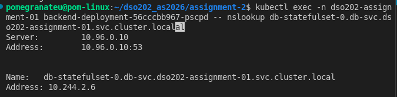

## Demonstrate ordered scaling (2.1.2.2)
**This is the other core StatefulSet property: replicas are created and terminated one at a time, in strict order (-0 before -1 before -2), unlike a Deployment which creates all replicas in parallel. Let's scale up to 3 replicas and watch the ordering live.**

Open a watch in one terminal:

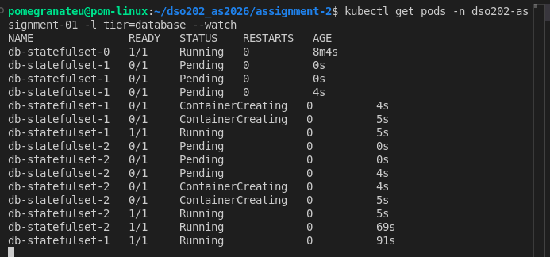

Now scale back down to 1, since your app only expects a single db-svc backing instance:

```bash
kubectl scale statefulset db-statefulset -n dso202-assignment-01 --replicas=1
```

Watch it terminate — StatefulSets also terminate in reverse order (highest index first), which is worth noting too:

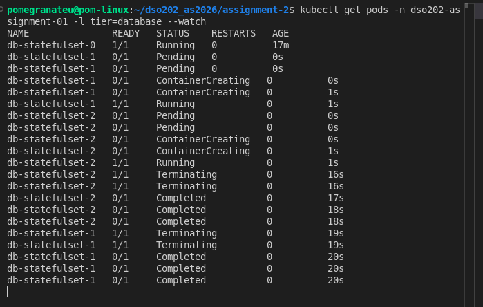

Then confirm you're back to a clean single-instance state:

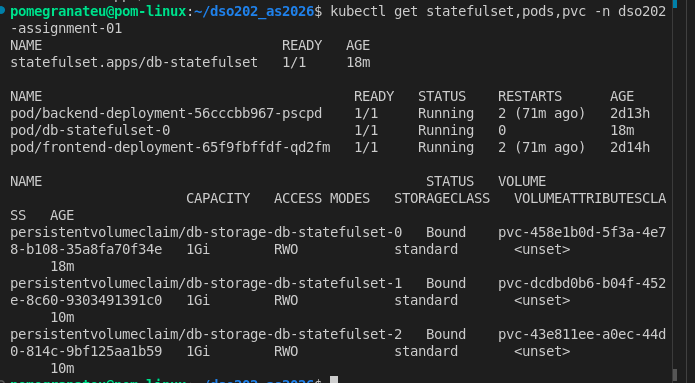

### Create the Ingress resource (2.2.1.1, basic routing rules)

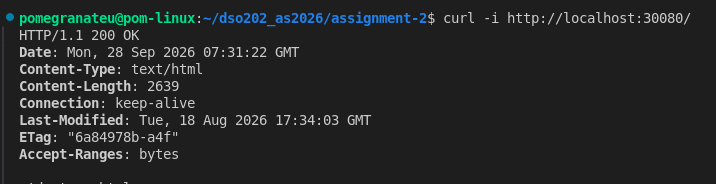
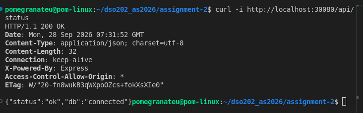

**If you open http://localhost:30080 in the browser right now, the UI will load, but the "backend unreachable" banner will probably still be there. BACKEND_URL in the ConfigMap still says http://backend-svc:8080, which a browser can't resolve. Fixing that is the next step. It's a real ConfigMap change followed by a frontend restart, so it deserves its own step.**

### Fix the browser's backend URL
Before changing anything, check what the frontend actually hands to the browser. The image guide says the container renders BACKEND_URL into a served config file at startup

### Point BACKEND_URL at the Ingress
Update the ConfigMap in your Assignment 2 folder (Assignment 1's copy stays untouched as its own record)

A running container doesn't re-read its ConfigMap. The value was rendered into config.js once at startup, so the frontend Pod has to be restarted

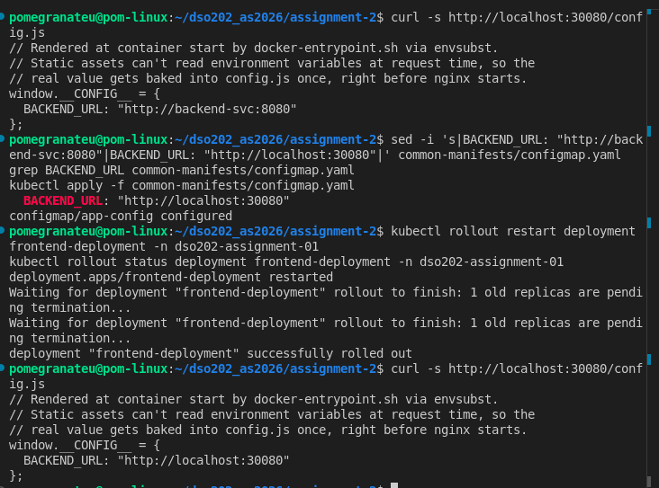

### Verify the backend is reachable from the browser

The live cluster shares this ConfigMap with your Assignment 1 setup, so the running state now reflects Assignment 2. That's fine, since Assignment 1's evidence is already captured. Just don't re-apply Assignment 1's ConfigMap later, or the banner will come back.

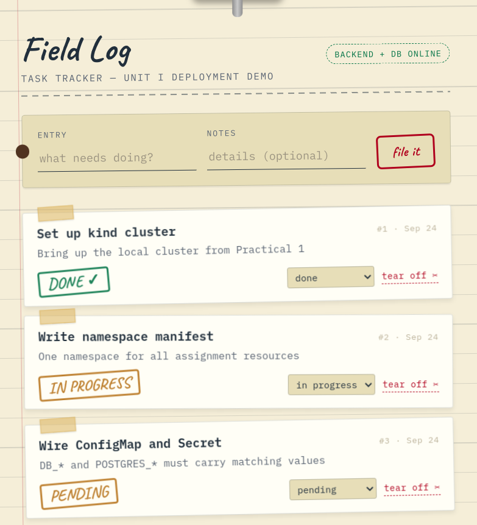
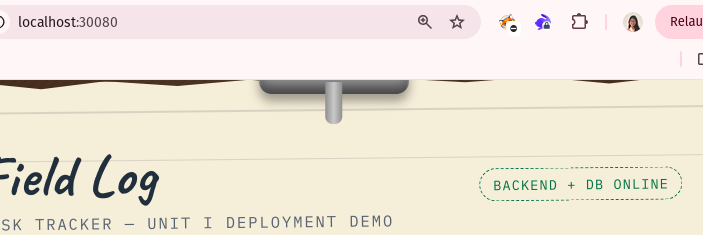
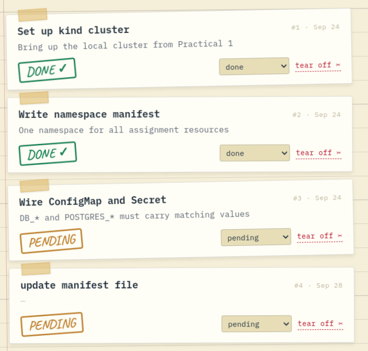

**Persistence test task" from Assignment 1 would still be in the list, and that was wrong. When we removed the old database Deployment in Step 2, we also deleted db-pvc. The StatefulSet then got a brand-new volume and re-ran the seed script. That's why you only see the three seed tasks and your new one got id #4. Nothing is broken, but the README should say the Deployment→StatefulSet move was a fresh start, not a data migration.**

### TLS termination and name-based virtual hosting (2.2.1.2 and 2.2.1.3)

The same IP and port serve two different applications depending only on the hostname, and the traffic is encrypted up to the controller and plain HTTP behind it. That's name-based virtual hosting plus TLS termination.

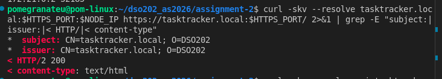
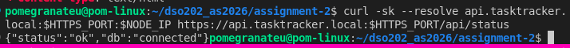

### Ingress annotations (2.2.3)

The head output should show an annotations: block under metadata:, and apply should say configured.

Now fire 30 rapid requests at the API host and print each status code. Before the annotation these would all be 200:

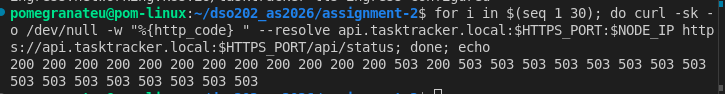

### ClusterRoles, aggregation and ClusterRoleBindings (2.3.1 and 2.3.2)

Assignment 1's RBAC was namespaced only: a Role, a RoleBinding and one ServiceAccount. Unit 2 adds the cluster-wide side, so this step covers three ideas:

* A ClusterRole can grant access to cluster-scoped resources like nodes, which a namespaced Role can never do.
* An **aggregated** ClusterRole assembles its rules automatically from any ClusterRole carrying a matching label.
* A ClusterRoleBinding applies the role across every namespace.

Now check the permissions, including the contrast with Assignment 1's namespaced account:

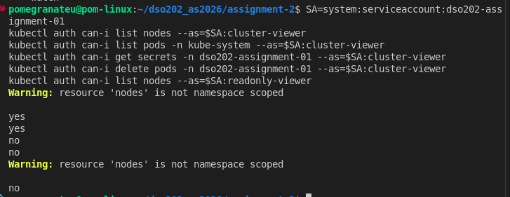

### Service accounts for Pod authentication (2.3.3)

So far the ServiceAccounts have only been impersonated from your terminal. Here a Pod actually runs as one. Kubernetes mounts a token for the ServiceAccount into the Pod, and the Pod uses it to authenticate to the API server. That shows 2.3.3.1 (creating and managing) and 2.3.3.2 (Pod authentication) in action.

This is a temporary demo Pod, reusing the frontend image that's already loaded on your nodes (it has curl) with the command overridden to sleep:

```bash
cat > rbac/sa-demo-pod.yaml << 'EOF'
apiVersion: v1
kind: Pod
metadata:
  name: sa-demo
  namespace: dso202-assignment-01
  labels:
    app: sa-demo
spec:
  serviceAccountName: cluster-viewer
  containers:
    - name: sa-demo
      image: sarojsanyasi/dso202-frontend:1.0
      command: ["sleep", "3600"]
EOF
kubectl apply -f rbac/sa-demo-pod.yaml
kubectl get sa -n dso202-assignment-01
kubectl wait --for=condition=ready pod/sa-demo -n dso202-assignment-01 --timeout=120s
```

It deliberately has no tier label. The brief wants one on every Pod, but a tier: frontend label here would make frontend-svc start routing real traffic to this sleeping Pod. It's throwaway, and we delete it right after.

First, see the credentials Kubernetes mounted for you:

```bash
kubectl exec -n dso202-assignment-01 sa-demo -- ls /var/run/secrets/kubernetes.io/serviceaccount
```

You should see ca.crt, namespace and token. Then have the Pod call the API server as itself, using that token:

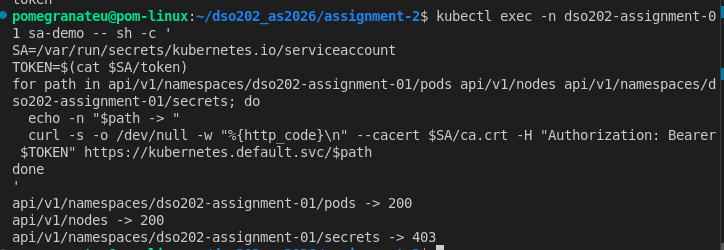

### Install the CloudNativePG operator (2.4)

The current release is 1.30.1. The docs say to apply it with --server-side, because the CRDs are too large for a normal kubectl apply.

```bash
kubectl apply --server-side -f \
  https://raw.githubusercontent.com/cloudnative-pg/cloudnative-pg/release-1.30/releases/cnpg-1.30.1.yaml
```

Then wait for the operator to come up:

```bash
kubectl rollout status deployment -n cnpg-system cnpg-controller-manager
kubectl get pods -n cnpg-system
```

Now the part that matters for 2.4.1.1, the CRDs the install registered:

```bash
kubectl get crd | grep cnpg
kubectl api-resources --api-group=postgresql.cnpg.io
```

You should see clusters.postgresql.cnpg.io among others. That's a new resource type, Cluster, that didn't exist in Kubernetes five minutes ago. The operator watches for objects of that type and builds everything else itself.

Two things to watch for:
* **Kubernetes version**. Your kind nodes run v1.36.1. A guide I found for the 1.29.x series lists support for 1.33–1.35, and I couldn't find the support matrix for 1.30, so your version may be newer than what the operator was tested against. Newer versions usually work fine, but if the operator pod crash-loops, paste kubectl logs -n cnpg-system deploy/cnpg-controller-manager and we'll deal with it then.

* **Image pulls**. The operator image comes from ghcr.io, not Docker Hub. If a pull times out like before, wait a bit and retry. Deleting the stuck pod makes it try again.

### Confirm the CRDs, then pre-pull the PostgreSQL image

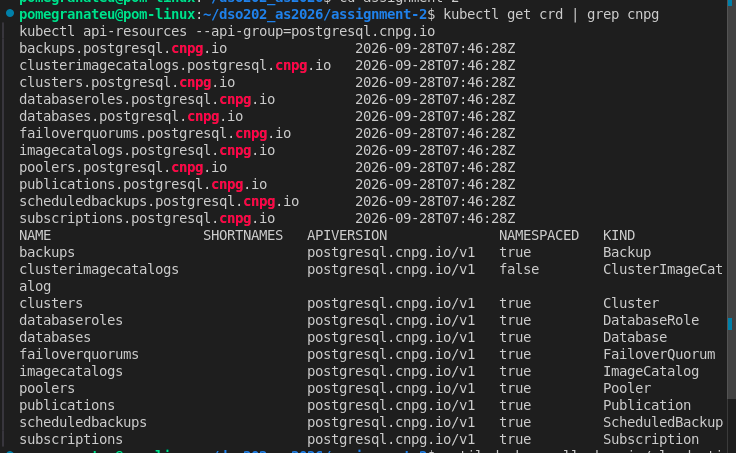

### Create the operator-managed database

* **instances: 2** gives one primary and one streaming replica. Your hand-written StatefulSet couldn't do that, because it had no replication logic. That's the value an operator adds.
* **Explicit** resources keep the pods inside the LimitRange and ResourceQuota from Task 6. Without them the LimitRange would give Postgres only a 256Mi limit.
* **owner: taskuser** puts a username in the manifest, because the operator requires the owner to be named. The password stays in the Secret. The brief says credentials belong in the Secret only, so note this in the README as an identifier the operator API requires, not a password.

Everything named tasks-pg-* (pods, PVCs, the -rw, -ro and -r Services, the generated secrets) came from a single 25-line manifest, and it's the clearest evidence for 2.4.1 and 2.4.3.

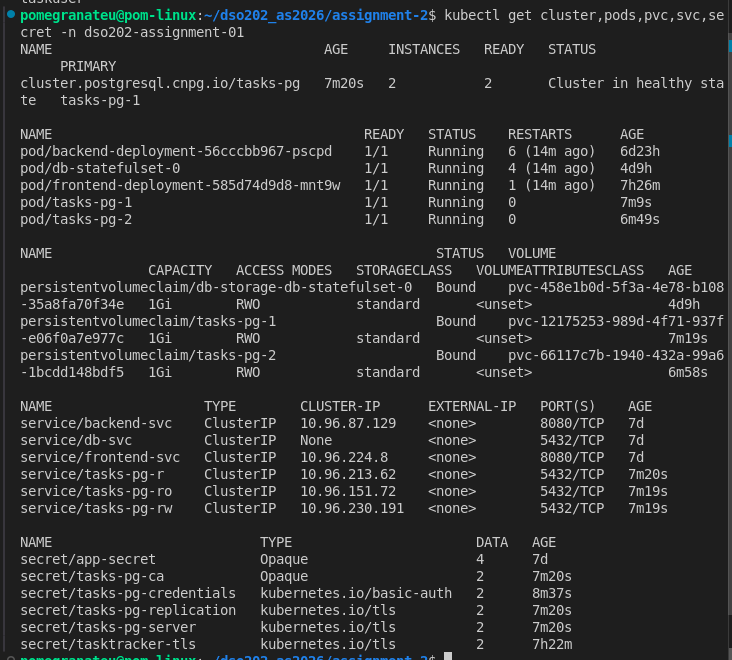

### Check the schema, then cut the backend over

Everything is up now, so re-run the checks:

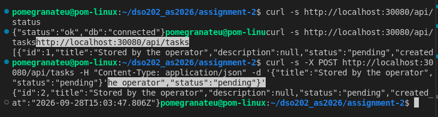

Then check that the row reached both instances:

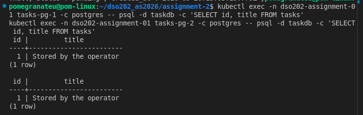

### Failover, what an operator does that a StatefulSet can't (2.4.1.2)

A manually managed Postgres StatefulSet dies with its pod until Kubernetes restarts it, and it can't promote anything. An operator's job is to notice and repair. We'll kill the primary and watch it happen.

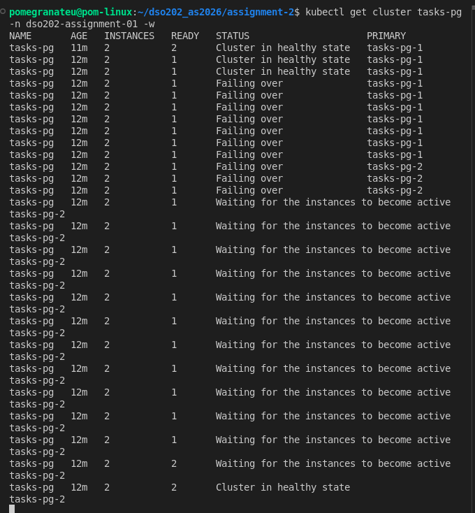

Then check what the outcome looks like from the application side:

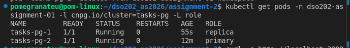
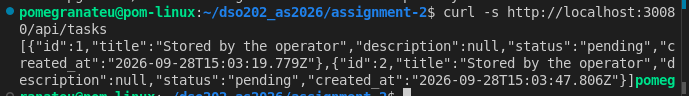

Both tasks should still be there, and tasks-pg-2 should carry the primary role. No hand-written config told the Service where to send traffic. tasks-pg-rw follows whichever pod is primary.

Two things to expect:

* A short blip. The backend may return an error for a few seconds during the switch, because its existing database connections die with the old primary. If it does, wait about ten seconds and retry. Note what you saw in the report, since it's real behavior.
* A backend restart is possible. If the backend exits on the dropped connection, Kubernetes restarts it, which is the self-healing you demonstrated in Assignment 1.

That's a clean failover. PRIMARY moved from tasks-pg-1 to tasks-pg-2 after passing through Failing over and Waiting for the instances to become active, and the cluster ended in Cluster in healthy state with 2 of 2 ready. The deleted pod came back and rejoined without any commands from you, and the whole sequence took well under a minute. 📸 Screenshot this watch output, since it's the direct evidence for 2.4.1.2.

That covers the cluster side. Now the application side, to show the data survived and the roles swapped:

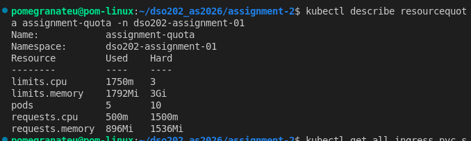

---

## 10. Known Deviations, Constraints and Troubleshooting Notes

- **Fresh database, not a migration.** The Deployment-to-StatefulSet change deleted the Assignment 1 PVC, and the operator-managed database started empty on PostgreSQL 18 (the tutor's image runs 17.11). No data was carried across at either step.
- **Live cluster shared with Assignment 1.** Assignment 2 modified the running Assignment 1 setup (Services, ConfigMap, database). The Assignment 1 manifests in their own folder no longer match the live cluster.
- **Ingress controller was pre-existing** and its Service was patched to fit the cluster's single host port mapping (Section 5.1). Recreating the cluster from `kind-cluster.yaml` alone would need the same patch, or port mappings for 80 and 443.
- **`BACKEND_URL` is tied to `localhost:30080`.** It only works while the Ingress is reached on that address. Behind a real hostname it would need changing, or the frontend could call a relative `/api` path.
- **HTTPS is only reachable through the node's Docker IP**, since the cluster maps no host port for it. This is a limitation of the kind port mapping, not of the Ingress.
- **Traefik was not installed** (comparison only, Section 5.6). A custom operator was not written (Section 7).
- **ingress-nginx is retired upstream** (Section 5.1); acceptable for a local exercise, not for production.
- **No readiness probes** (Unit I scope). After the backend restart at cutover, the Deployment reported the rollout finished while the container was still starting under emulation, and requests through the Ingress returned `502 Bad Gateway` until the server began listening. The backend log then showed `[db] connected` and `[server] listening on :8080`.
- **Registry pulls stalled repeatedly.** Docker Hub and `ghcr.io` both produced `TLS handshake timeout` or an indefinite `Pulling image`. Images were pulled on the host with a retry loop and loaded with `kind load docker-image`. The tutor's images are `linux/arm64` only and run on this `x86_64` host under QEMU emulation (see the Assignment 1 README); the CloudNativePG images are multi-architecture and run natively.
- **`tier` label on operator-managed Pods.** Assignment 1 required a `tier` label on every Pod, Deployment and Service. The Pods and Services generated by the CloudNativePG operator carry the operator's own labels (for example `cnpg.io/cluster=tasks-pg`) and no `tier` label.
- **Self-signed certificate.** Browsers and `curl` do not trust it; `curl -k` was used for testing. A real deployment would use a certificate from a trusted issuer.
- **Secrets remain base64-encoded, not encrypted at rest,** as documented in the Assignment 1 README. The new TLS Secret and the operator-generated Secrets are subject to the same caveat.