# DSO202 — Practical 1 Report

**Setting Up a Local Kubernetes Cluster with kind, and Deploying First Workloads**

| | |
|---|---|
| Student | Pema Tshering Yangchen |
| Student ID | 2230295 |
| Module | DSO202 — Scaling, Orchestration, Monitoring & Observability |
| Programme | BE in Software Engineering |

---

## 1. Objective

- Build a local three-node Kubernetes cluster with `kind`.
- Create, inspect, break, and repair five categories of Kubernetes object: Namespace, ResourceQuota/LimitRange, Pod, Deployment, Service.
- Descriptor sections covered: Unit I — 1.1, 1.2.1, 1.2.2, 1.2.3, 1.2.4, 1.3.1, 1.3.2, 1.3.3, 1.4.1, 1.5.1, 1.5.3.
- Learning Outcomes addressed: LO1 (core concepts/architecture), LO2 (deploying/managing via resource types), LO3 (operating kubectl), LO5 part (namespace multi-tenancy).

## 2. Environment

| Item | Value |
|---|---|
| OS | Pop!_OS 22.04 LTS |
| Docker | 28.0.1 |
| kind | v0.32.0 |
| kubectl (client) | v1.36.0 |
| Cluster Kubernetes version | v1.36.1 |
| Container runtime | containerd 2.3.1 |
| Node OS image | Debian GNU/Linux 13 (trixie) |

**Setup notes:**
- kubectl was initially v1.34.1 (two minor versions behind the cluster, outside supported skew) → upgraded to v1.36.0.
- Available memory was initially ~3.2 GiB free due to a local GitLab instance running in the background → stopped it, freed up to ~8.6 GiB, above the 4 GiB minimum.

## 3. Deviations from the supplied materials

| # | Issue | Fix |
|---|---|---|
| 1 | Namespace name inconsistent across listings (`dso202-practical` vs `dso202-practical-01`) | Standardised on `dso202-practical` everywhere |
| 2 | `manifests/02-pod-web.yaml` / `03-deployment-web.yaml` had no `readinessProbe`, but Stage 6 Step 7 assumes one exists | Added an `httpGet` readiness probe to the Deployment, re-applied |
| 3 | Report's Analysis section references "review questions in section 21" — guide as supplied ends at section 12 | Analysis rebuilt around the descriptor's stated Learning Outcomes instead |

---

## 4. Procedure and Observations

### Stage 0 — Prerequisites

- Verified Docker (`docker info`), kind (`kind version`), kubectl (`kubectl version --client`) individually.
- kubectl upgraded from v1.34.1 to v1.36.0.
- Checked memory/disk (`free -h`, `df -h`); stopped a locally running GitLab instance to free memory.

*(No screenshots — verified via terminal text only.)*

### Stage 1 — Creating the three-node cluster

- `kind create cluster --config cluster/kind-cluster.yaml` → cluster `dso202` created, all 7 progress steps succeeded.
- `kind get clusters` → `dso202`.
- `kind get nodes --name dso202` → 3 containers listed.
- `kubectl config current-context` → `kind-dso202`.

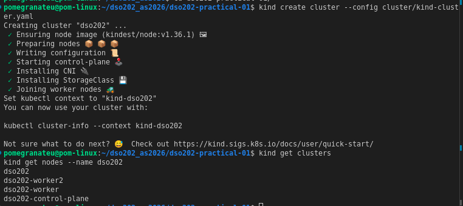

### Stage 2 — Inspecting the cluster and its components

- `kubectl config current-context` + `kubectl cluster-info` → API server + CoreDNS addresses on randomised localhost port.

  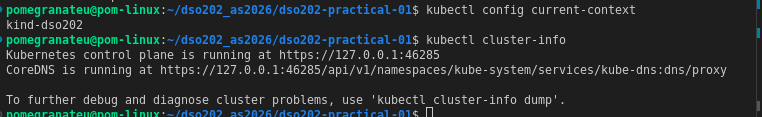

- `kubectl get nodes` and `kubectl get nodes -o wide` → 3 nodes `Ready`, correct renamed Node objects (`control-plane`, `worker-node-1`, `worker-node-2`).

  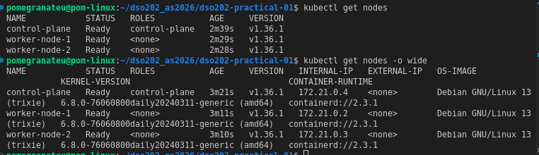

- `kubectl describe node worker-node-1` → confirmed labels `dso202/node-role=worker`, `dso202/node-index=1`.

  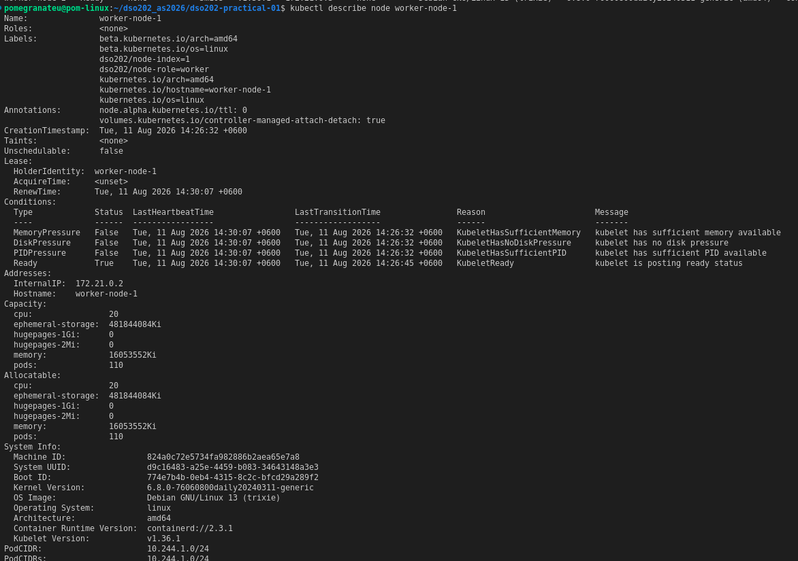

- `kubectl get node worker-node-1 -o jsonpath='{.metadata.labels}'` → labels extracted cleanly.

  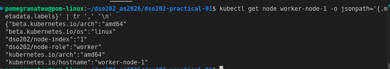

- `kubectl get namespaces` → 5 default namespaces present.

  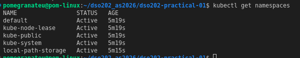

- `kubectl get pods -n kube-system -o wide` → control-plane components (`etcd`, `kube-apiserver`, `kube-controller-manager`, `kube-scheduler`) each appear once on `control-plane`; `kindnet`/`kube-proxy` appear 3× (once per node); `coredns` appears 2×, both on `control-plane`.

  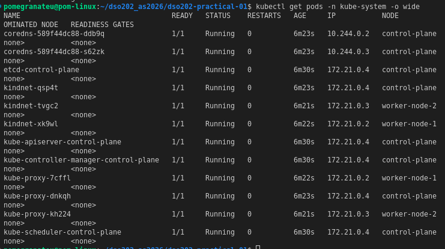

- `kubectl logs -n kube-system kube-scheduler-control-plane` → transient RBAC `Forbidden` errors at startup, resolved once `Caches are synced` (normal, not a fault — no screenshot taken, text output only).

- `kubectl api-resources --namespaced=true/false` → confirmed namespaced vs cluster-scoped split.

  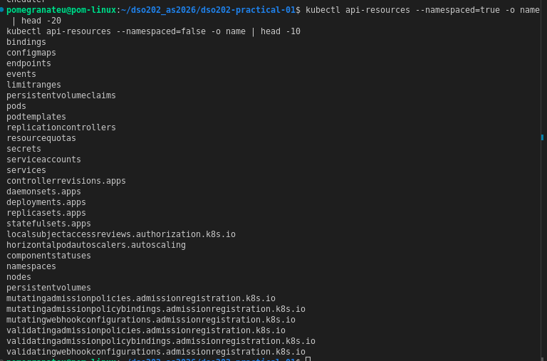

### Stage 3 — Namespace, ResourceQuota, LimitRange

- Imperative namespace (`dso202-scratch`) created/deleted to see the form.

  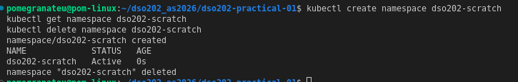

- `kubectl create namespace dso202-practical --dry-run=client -o yaml` → confirmed it omits labels/annotations.

  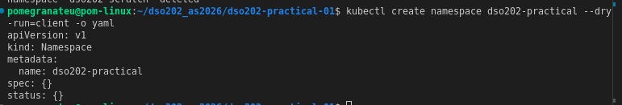

- Applied `manifests/00-namespace.yaml`, `manifests/01-quota-and-limits.yaml`.
- `kubectl describe resourcequota dso202-quota` → `count/configmaps: 1/10` before any workload (the auto-created `kube-root-ca.crt`).

  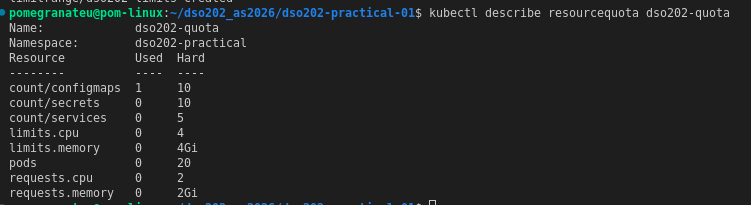

- `kubectl describe limitrange dso202-limits` → confirmed bounds (CPU 10m–1, memory 16Mi–512Mi; defaults 50m/64Mi request, 200m/128Mi limit).

  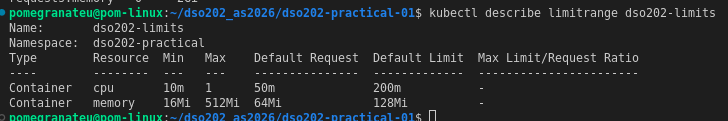

- `limitrange-check` Pod created with **zero** resource declarations → confirmed LimitRange defaults were injected automatically (text output only, no screenshot).

### Stage 4 — Pods

- Imperative Pod (`web-imperative`) created, watched to `1/1 Running`, captured to `evidence/web-imperative-as-stored.yaml`, deleted (text output only, no screenshot).
- Declarative Pod (`manifests/02-pod-web.yaml`) applied twice → `created` then `unchanged`; `kubectl get pod web-pod -o wide` → scheduler-chosen node, cluster-internal IP.

  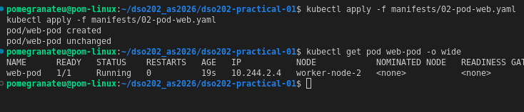

- Resource declarations confirmed via jsonpath + quota cross-check.

  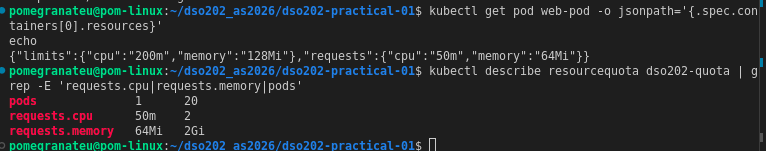

- `kubectl describe pod web-pod` → full detail including Events (`Scheduled` → `Pulled`/`Created`/`Started`).

  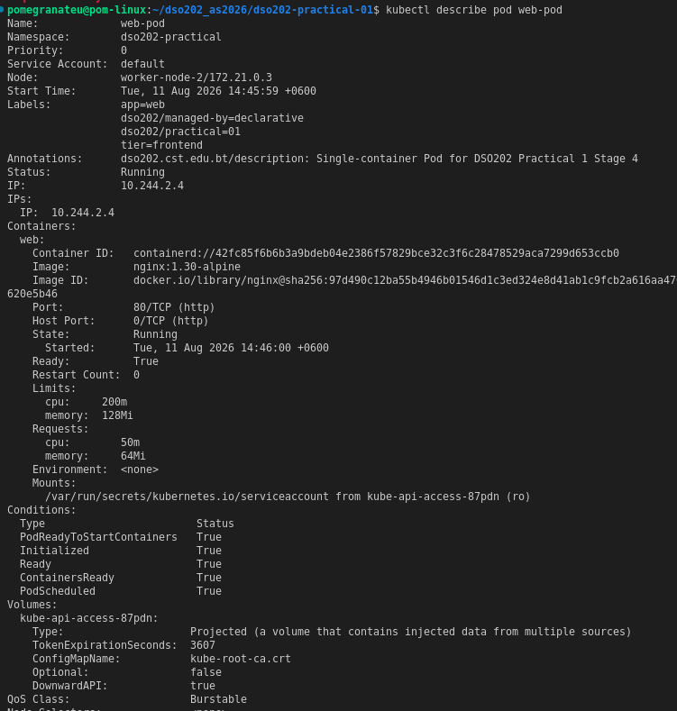

- Label selectors tested: `-l app=web`, `-l tier=frontend,dso202/managed-by=declarative`, `-l 'tier in (frontend,backend)'`, `-l app!=web`.

  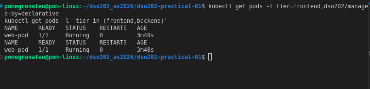

- Label add/remove (`kubectl label ... environment=practical` / `environment-`).

  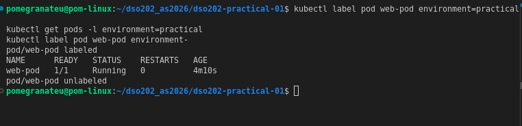

- Annotation added, confirmed not selectable.

  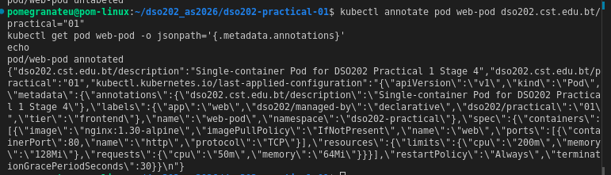

- `kubectl exec -it web-pod -- sh` → hostname, os-release, ls html dir, wget localhost.

  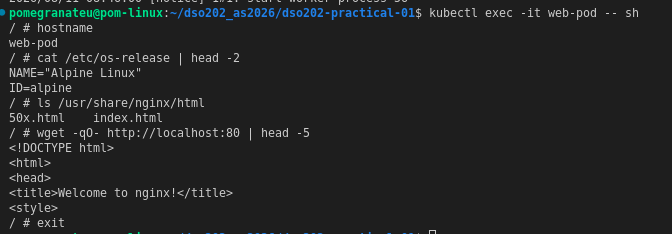

- `kubectl port-forward pod/web-pod 8080:80` (tunnel started).

  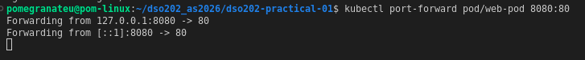

- `curl -s http://localhost:8080` from a second terminal → nginx welcome page.

  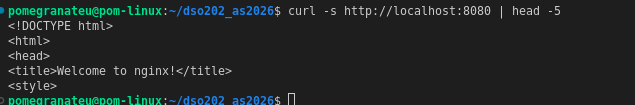

- Port-forward terminal showing `Handling connection for 8080`.

  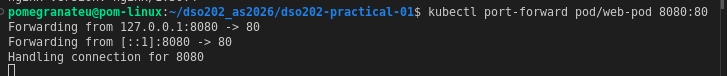

- `kubectl explain pod.spec.containers.resources`.

  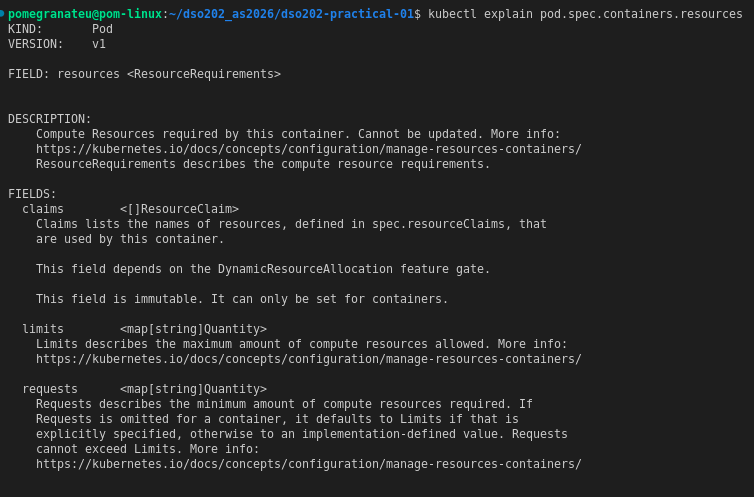

### Stage 5 — Deployments

- Dry-run `kubectl create deployment --dry-run=client -o yaml` → confirmed gaps (no strategy, resources, probes).

  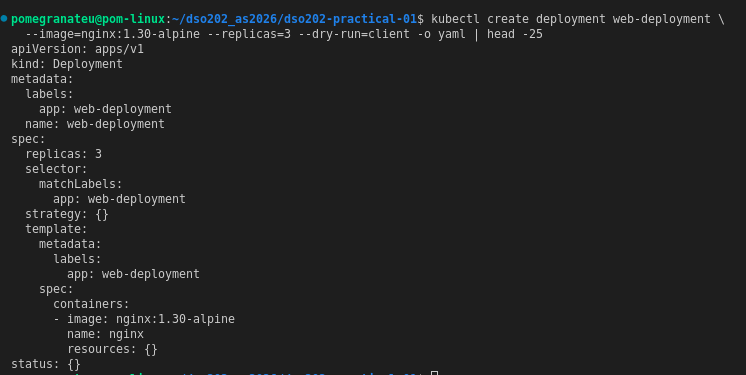

- `manifests/03-deployment-web.yaml` applied → rolled out to `3/3` (text output only for this specific apply, folded into later screenshots).
- Self-healing demo: deleted one Pod → replacement appeared within seconds.

  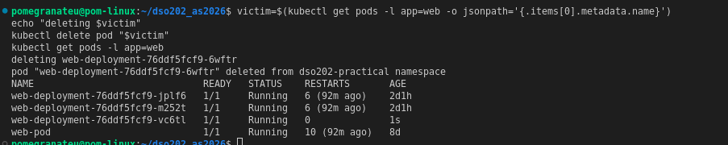

- `kubectl get events --field-selector reason=SuccessfulCreate` → `SuccessfulCreate` attributed to the **ReplicaSet**, not the Deployment.

  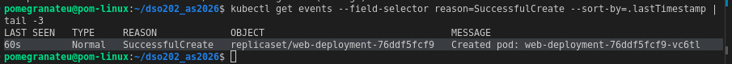

- Imperative scale to 5 replicas.

  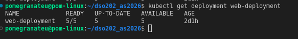

- Re-applying the manifest silently reverted to 3 replicas (manifest is source of truth).

  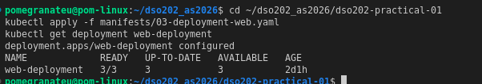

- Rolling update to `nginx:1.31-alpine` with `change-cause` annotation, watched in split terminal.

  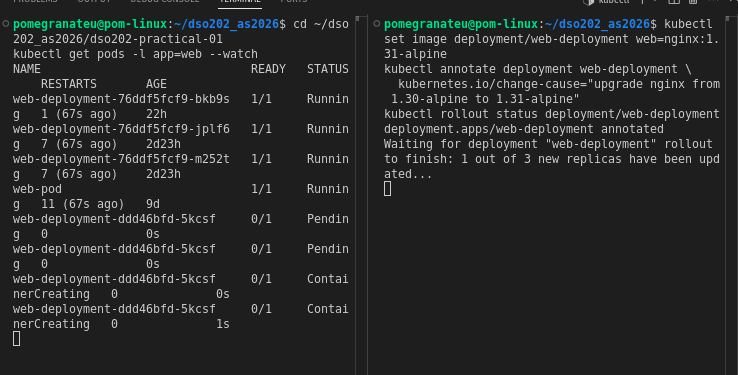

- Rollout settled: new ReplicaSet at 3/3, old ReplicaSet at 0.

  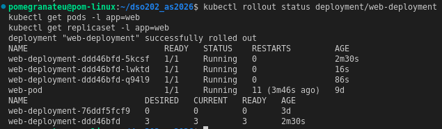

- `kubectl rollout history` → 2 revisions, `CHANGE-CAUSE` populated correctly.

  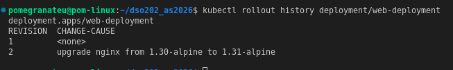

- `kubectl rollout history --revision=1 | grep image` → confirms revision 1 was `nginx:1.30-alpine`.

  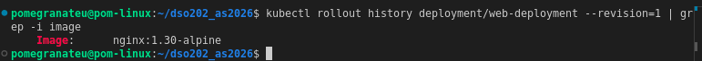

- `kubectl rollout undo` → reverted cleanly to `nginx:1.30-alpine`.

  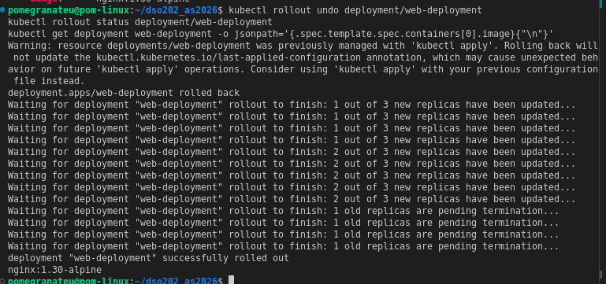

- Deliberate failed rollout (`nginx:9.99-does-not-exist`) → stalled after timeout; 3 original healthy Pods never removed.

  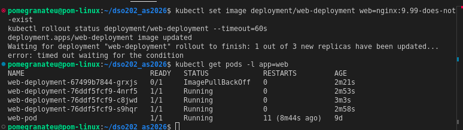

- Diagnosed (`describe pod | grep Failed`), rolled back, recovered.

  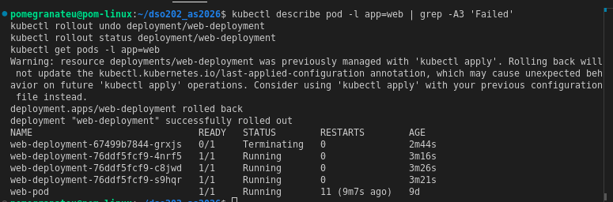

- Final `kubectl apply` + `kubectl diff` → no diff, cluster matches manifest.

  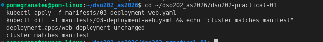

### Stage 6 — Services

- ClusterIP Service (`manifests/04-service-clusterip.yaml`) applied.

  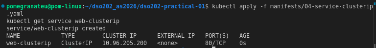

- EndpointSlice inspected → included `web-pod` in addition to the 3 Deployment replicas (same labels, so same selector match).

  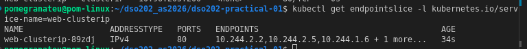

- `client-pod` applied and waited ready.

  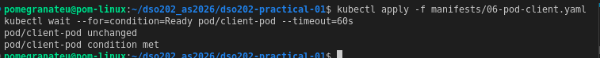

- `nslookup web-clusterip` → resolved correctly (`10.96.205.200`) despite a busybox exit-code-1 false negative — see Reflection.

  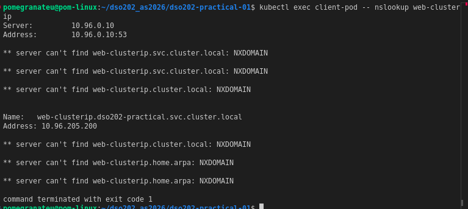

- `wget -qO- http://web-clusterip` → nginx welcome page retrieved successfully. 
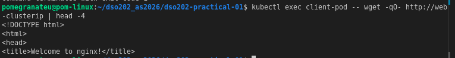

- Load-balancing test (distinct `index.html` per Pod, 9 requests) → all 4 matching Pods answered.
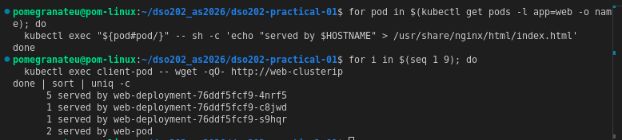

- Readiness-gating demo, first attempt: manifests had no `readinessProbe`, deleting `index.html` did not remove the Pod from the EndpointSlice. 
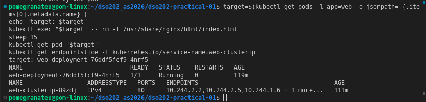

- Added `readinessProbe` to `manifests/03-deployment-web.yaml`, re-applied (triggered rolling update). 
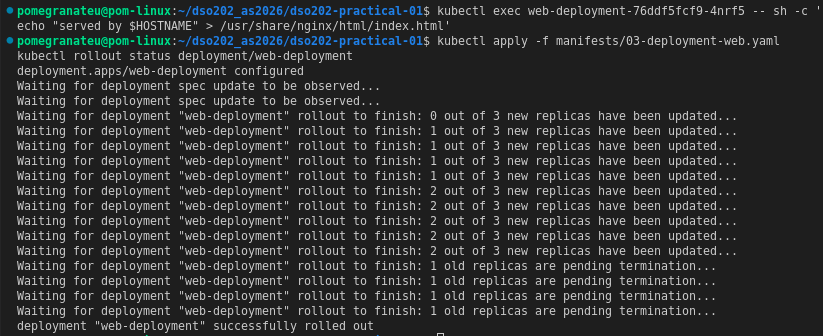

- Readiness-gating demo redone: target Pod dropped to `0/1`, removed from EndpointSlice. 
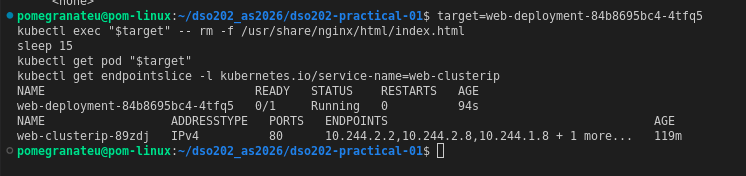

- Restored `index.html` → Pod rejoined EndpointSlice within ~10s. *
- `broken-service` (imperative, mismatched selector) → EndpointSlice `<unset>`. 
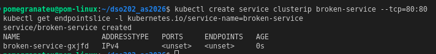

- NodePort Service (`manifests/05-service-nodeport.yaml`) applied. 
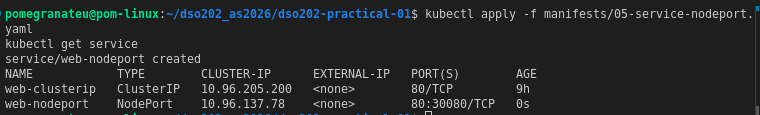

- `curl http://localhost:30080` → reached from host. 
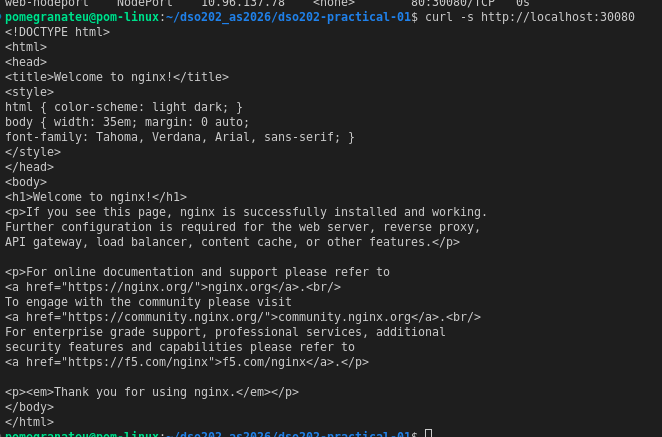

- `docker exec dso202-worker curl http://localhost:30080` → NodePort open on every node. 
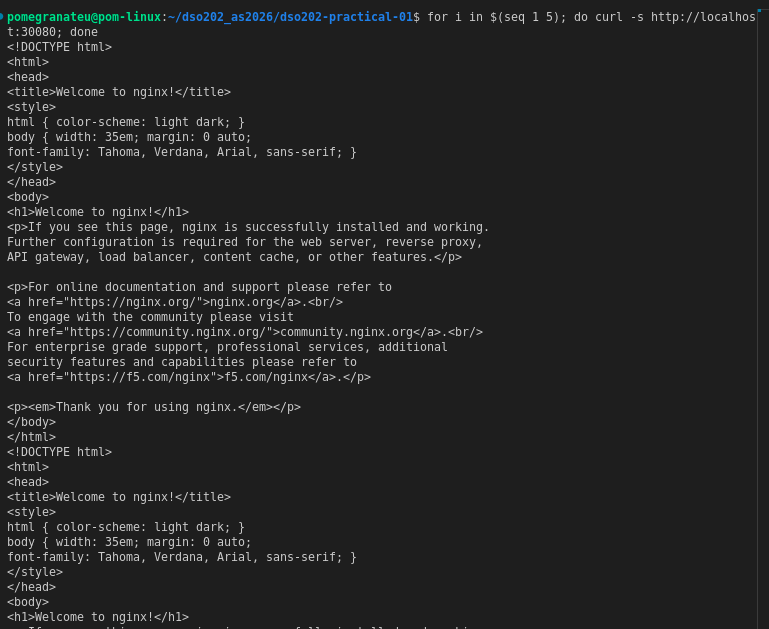

- `lb-demo` LoadBalancer Service → `EXTERNAL-IP: <pending>` confirmed. *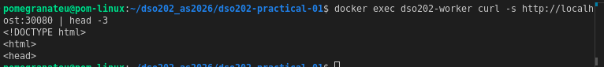*
**

### Stage 7 — Cleanup

- Captured final-state evidence to `evidence/final-state-*.txt`. 
- Deleted all workload objects

** declaratively, in reverse creation order; `kubectl get all` confirmed empty namespace. 
- `kubectl apply -f manifests/` → rebuilt everything in one command. *!
- Settled state confirmed `3/3` Deployment, all Pods `Running`. *!
- `kind delete cluster --name dso202` → deleted; `kind get clusters` / `docker ps` confirmed no trace remained. 

---
## 5. Analysis

*Note: the guide's Analysis section references "review questions in section 21," which does not exist in either copy of the guide supplied for this practical (both end at section 12). Analysis below is built around the descriptor's stated Learning Outcomes instead.*

**LO1 — Core concepts and architecture**
- Control-plane components (`etcd`, `kube-apiserver`, `kube-scheduler`, `kube-controller-manager`) run exactly once, only on the control-plane node.
- `kube-proxy`/`kindnet` run once per node, as DaemonSets.
- Matches the architecture taught in lecture; confirmed via Stage 2.

**LO2 — Deploying/managing via resource types**
- Progression: bare Pod (no self-healing) → ResourceQuota/LimitRange (governs, doesn't run) → Deployment (adds replica management, rollout, rollback) → Services (ClusterIP internal stability, NodePort external reachability).
- Clearest evidence of active *management* (not just creation): the self-healing demo and the failed-rollout-then-recovery sequence in Stage 5.

**LO3 — Operating kubectl**
- Standard troubleshooting sequence (`get -o wide` → `describe` Events → `logs`) used throughout.
- Used for genuine unscripted diagnosis twice: outdated kubectl in Stage 0, and the busybox `nslookup` false negative in Stage 6.

**LO5 (part) — Namespace multi-tenancy**
- ResourceQuota + LimitRange pair: quota makes declarations mandatory once a compute cap is set; LimitRange supplies defaults so an imperative command isn't rejected outright.
- `count/configmaps: 1/10` before any user workload — a reminder that quota `Used` counts everything in the namespace, including cluster-created objects.

## 6. Reflection

**What was difficult**
- Working across multiple sessions over several days meant the Docker host restarted more than once between sessions.
- This surfaced as climbing `RESTARTS` counts and `SandboxChanged` events on healthy Pods — had to distinguish infrastructure-level restarts from real application failures by reading Events, not just the RESTARTS number.

**Specific errors diagnosed**

| Error / symptom | Cause | Diagnosis method | Fix |
|---|---|---|---|
| Readiness-gating demo (Stage 6 Step 7) showed no change | `manifests/02-pod-web.yaml` / `03-deployment-web.yaml` had no `readinessProbe` — guide's Step 7 assumes one exists (references "Listing 8," actually the client Pod) | Read manifests line by line against the guide's assumption | Added `httpGet` readiness probe to the Deployment, re-applied, redid the demo |
| `nslookup web-clusterip` → `exit code 1` despite correct resolution | busybox resolver queries every DNS search-list suffix even after a match, reports the *last* (failed) query's exit code | Read full output, found correct answer mid-stream | No fix needed — false negative, documented and moved on |
| Pod restart counts climbing across sessions | Docker host restarted between sessions (not app crashes) | `kubectl describe pod` Events → `SandboxChanged`, not `Failed`/`OOMKilled` | No fix needed — confirmed as infra noise, not a defect |

**What would be done differently**
- Completing this in fewer, longer sessions (closer to the guide's assumed single 2-hour sitting) would have produced cleaner evidence with less need to explain away host-restart artefacts.

**What remains unclear**
- The guide's Analysis section instructs answering "review questions in section 21," but the guide as supplied ends at section 12. Unclear whether this is a stale cross-reference to an earlier/fuller version, or a section genuinely omitted from the copy provided.

## 7. References

- kind documentation, Quick Start — https://kind.sigs.k8s.io/docs/user/quick-start/ 

- Kubernetes documentation — https://kubernetes.io/docs/ 

- Docker Engine installation docs — https://docs.docker.com/engine/install/ 

- DSO202_Practical1_Guide.md and DSO202_Practical1_Manifests.md (module-supplied)