# DSO202 Practical 2 — Report
## Implementing Persistent Storage for a Stateful Application in Kubernetes

---

## 1. Objective

This practical implements persistent storage for a stateful application in
Kubernetes, using a local `kind` cluster. It covers the descriptor's Unit I
sections on Volumes, PersistentVolumes, PersistentVolumeClaims, and
StorageClasses (1.2.5, 1.4.1, 1.4.2, 1.4.3, 1.5.3), and Unit II's introduction
to StatefulSets (2.1.1–2.1.4). The practical is built around two ideas taken
in sequence: first, the storage layer that answers where data physically
lives and what happens to it when a Pod, claim, or workload is removed;
second, the workload controller — the StatefulSet — designed for applications
that cannot treat their replicas as interchangeable.

---

## 2. Environment

| Field                       | Detail                                          |
|-----------------------------|--------------------------------------------------|
| Operating System            | Linux (host: pom-linux)                          |
| Docker Engine               | 28.0.1                                           |
| kind                        | v0.32.0                                          |
| kubectl (client)            | v1.36.0                                          |
| Cluster Kubernetes version  | v1.36.1 (`kindest/node:v1.36.1`)                 |
| PostgreSQL image            | `postgres:18-alpine`                             |
| Cluster name                | `dso202-p2` (context `kind-dso202-p2`)           |
| Namespace                   | `dso202-practical-02`                            |

---

## 3. Procedure and Observations

### 3.0 Stage 0 — Prerequisites and Verification

**What was done.** Tool versions were confirmed, the Practical 1 cluster was
removed to avoid running two clusters at once, and the host directory used
for static provisioning was created ahead of cluster creation.

```
$ docker info --format '{{.ServerVersion}}'
$ kind version
$ kubectl version --client

$ kind get clusters

$ mkdir -p /tmp/dso202-p2-storage
$ ls -ld /tmp/dso202-p2-storage

$ df -h /var/lib/docker 2>/dev/null || df -h /
```

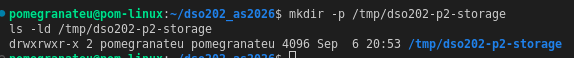

This confirms all three tools meet the minimum versions, no conflicting
cluster exists, the host directory required by Stage 2 is in place before
cluster creation (kind mounts it at creation time), and disk space (206G
free) is well above the ~3GB the practical needs.

---

### 3.1 Stage 1 — Cluster, Namespace, and the Storage Landscape

**What was done.** A three-node `kind` cluster was created from the
committed configuration, the Node ↔ Docker container name mapping was
recorded, the namespace/quota/StorageClass manifests were applied, and the
cluster's storage provisioner was located and inspected.

```
$ kind create cluster --config cluster/kind-cluster.yaml
```

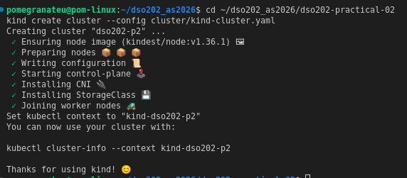

```
$ kubectl get nodes -o wide
```

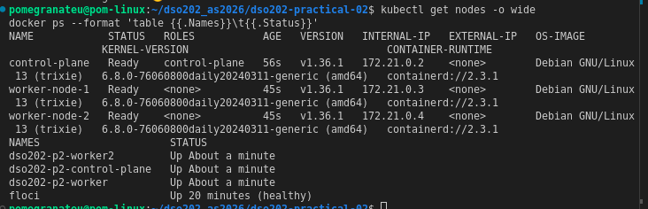

```
$ docker ps --format 'table {{.Names}}\t{{.Status}}'
```

This confirms the custom node-name patches in `cluster/kind-cluster.yaml`
applied correctly (no fallback config was needed): `kubectl get nodes` shows
`control-plane`, `worker-node-1`, `worker-node-2`, mapping to Docker
containers `dso202-p2-control-plane`, `dso202-p2-worker`, `dso202-p2-worker2`
respectively.

```
$ docker exec dso202-p2-worker ls -ld /mnt/dso202-static
```

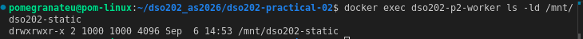

This confirms the host bind mount from `/tmp/dso202-p2-storage` reached
`worker-node-1` at cluster-creation time, as declared in `extraMounts`.

```
$ kubectl apply -f manifests/00-namespace.yaml
$ kubectl config set-context --current --namespace=dso202-practical-02
$ kubectl apply -f manifests/01-quota-and-limits.yaml
$ kubectl apply -f manifests/02-storageclass-retain.yaml
```

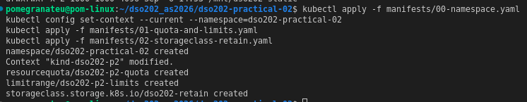

```
$ kubectl describe resourcequota dso202-p2-quota
```

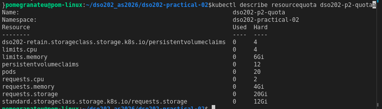

This confirms the namespace, quota (including the three storage-specific
caps: total claim count, total requested storage, and a per-StorageClass
cap), and the retaining StorageClass were all created successfully.

```
$ kubectl get storageclass
```

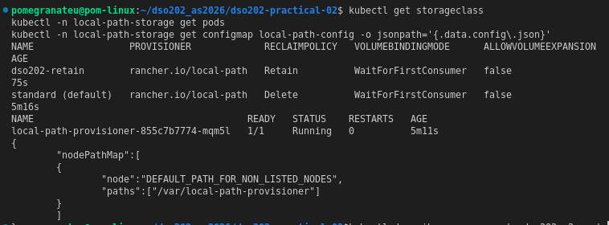

```
$ kubectl -n local-path-storage get pods

$ kubectl -n local-path-storage get configmap local-path-config -o jsonpath='{.data.config\.json}'
{
  "nodePathMap":[
  { "node":"DEFAULT_PATH_FOR_NON_LISTED_NODES", "paths":["/var/local-path-provisioner"] }
  ]
}
```

This confirms both StorageClasses share the same provisioner
(`rancher.io/local-path`) but differ in `RECLAIMPOLICY` (`Delete` vs
`Retain`); both defer binding until a consumer exists
(`WaitForFirstConsumer`); the provisioner Pod is running in its own
namespace, not the practical's; and every dynamically provisioned volume in
this practical will be written under `/var/local-path-provisioner` on
whichever node the consuming Pod lands on.

**Checkpoint reached:** `kubectl get storageclass` lists both classes, the
provisioner Pod is `Running`, and the node path is known.

---

### 3.2 Stage 2 — Static Provisioning, and the Meaning of Retain

**What was done.** A PersistentVolume was created by hand, describing a
directory that already exists on the host (via the bind mount into
`worker-node-1`). A claim was applied and observed to bind immediately, since
no StorageClass object matches its `manual` class name. A Pod mounted the
claim, and the volume's persistence was proven across Pod deletion and
recreation.

```
$ kubectl apply -f manifests/03-pv-static.yaml
$ kubectl get pv
```

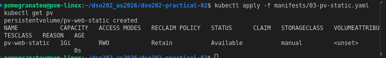

```
$ kubectl get pv pv-web-static -o jsonpath='{.spec.hostPath.path}{"\n"}'
/mnt/dso202-static/pv-web-static
$ kubectl get pv pv-web-static -o jsonpath='{.spec.nodeAffinity}{"\n"}'
{"required":{"nodeSelectorTerms":[{"matchExpressions":[{"key":"dso202/node-index","operator":"In","values":["1"]}]}]}}
```

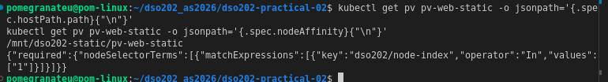

This confirms the PV was created in the `Available` phase, and that it
declares `nodeAffinity` for `dso202/node-index=1` (worker-node-1) — the
directory exists on exactly one node, so any Pod that mounts this volume can
only be scheduled there.

```
$ kubectl apply -f manifests/04-pvc-static.yaml
$ kubectl get pvc
```

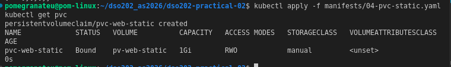

This confirms the claim bound immediately. No StorageClass object named
`manual` exists in the cluster; the name is only a matching label between
claim and volume, so no provisioner and no binding mode is involved — the
control plane simply found an `Available` PV whose class name, capacity, and
access mode satisfied the claim.

```
$ kubectl apply -f manifests/05-pod-static-writer.yaml
$ kubectl wait --for=condition=Ready pod/static-writer --timeout=90s
$ kubectl get pod static-writer -o wide
```

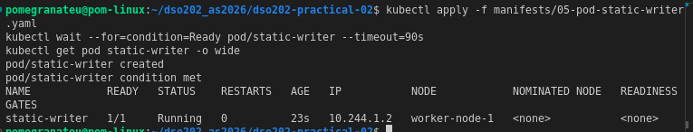

This confirms the Pod was scheduled onto `worker-node-1`, although no
`nodeSelector` or affinity rule was written into the Pod manifest — the
volume alone dictated placement.

```
$ kubectl exec static-writer -- cat /data/ledger.txt
$ cat /tmp/dso202-p2-storage/pv-web-static/ledger.txt
2026-09-06T15:08:00Z start pod=static-writer node=worker-node-1
```

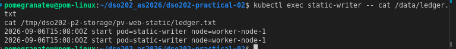

This confirms the same file is visible from inside the container and
directly on the host — the entire mechanism of a hostPath-backed PV is a
directory on a machine, mounted into a container, described to Kubernetes.

```
$ kubectl delete pod static-writer
$ kubectl apply -f manifests/05-pod-static-writer.yaml
$ kubectl wait --for=condition=Ready pod/static-writer --timeout=90s
$ kubectl exec static-writer -- cat /data/ledger.txt
```

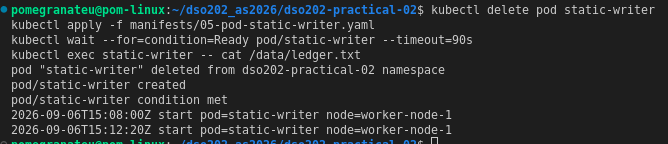

This confirms the volume outlived the Pod: two lines are present, the first
written by a Pod that no longer exists at the time the file was read. A new
Pod, created from the same manifest, reattached the same PVC and saw the
data the previous Pod had written.

**Checkpoint reached:** `ledger.txt` holds two lines proving persistence
across Pod deletion.

---

### 3.3 Stage 3 — Dynamic Provisioning, StorageClasses, and Two Uncomfortable Truths

**What was done.** A claim (`dynamic-data`) was applied against the
`standard` class with no consumer, to observe `WaitForFirstConsumer` in
isolation. A consumer Pod was then applied to trigger provisioning. The
claim's requested size was checked against the node's real disk capacity, a
resize was attempted against a class with `allowVolumeExpansion: false`, and
the claim was deleted to observe the `Delete` reclaim policy in full,
contrasted against `Retain` from Stage 2.

```
$ kubectl apply -f manifests/06-pvc-dynamic.yaml
$ kubectl get pvc dynamic-data
```

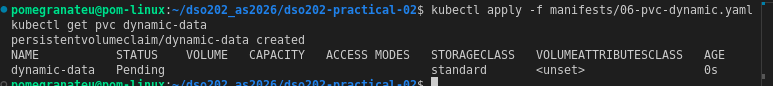

```
$ kubectl describe pvc dynamic-data | tail -n 6
```

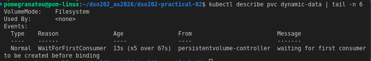

This confirms the claim staying `Pending` is expected behaviour on a
`WaitForFirstConsumer` class, not a fault — binding is deferred until a Pod
names the claim, so the volume can be created on the correct node.

```
$ kubectl apply -f manifests/07-pod-dynamic-writer.yaml
$ kubectl get pvc dynamic-data
$ kubectl get pv
```

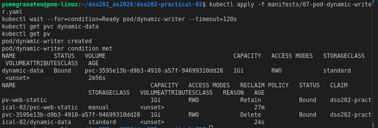

This confirms a PersistentVolume was created automatically the moment a
consumer existed — no manifest for it was written by hand. Its reclaim
policy (`Delete`) was inherited entirely from the `standard` StorageClass.

```
$ kubectl get pod dynamic-writer -o wide
```

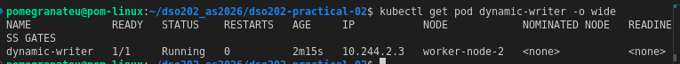

```
$ docker exec dso202-p2-worker2 ls /var/local-path-provisioner
```

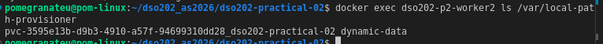

This confirms the provisioner's directory-naming convention: PV name,
namespace, and claim name concatenated, on the node the Pod was actually
scheduled to.

```
$ kubectl exec dynamic-writer -- df -h /data
```

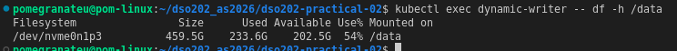

**First uncomfortable truth.** This confirms the claim requested 1Gi but the
container can see the entire node filesystem (459.5G available). The
`local-path` provisioner records the requested capacity in the API and
ignores it when creating the directory — nothing here prevents this Pod from
filling the whole node disk.

```
$ kubectl patch pvc dynamic-data --type merge -p '{"spec":{"resources":{"requests":{"storage":"2Gi"}}}}'
```

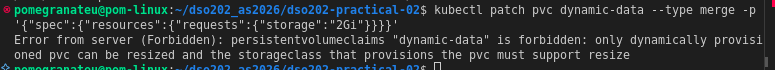

**Second uncomfortable truth.** This confirms the API server itself rejects
the resize attempt, caused by `allowVolumeExpansion: false` on the class —
a loud, immediate failure rather than a silent no-op.

```
$ kubectl exec dynamic-writer -- cat /data/ledger.txt
$ kubectl delete pod dynamic-writer
$ kubectl delete pvc dynamic-data
$ kubectl get pv
$ docker exec dso202-p2-worker2 ls /var/local-path-provisioner
# ~15 seconds later:
$ kubectl get pv
$ docker exec dso202-p2-worker2 ls /var/local-path-provisioner
```

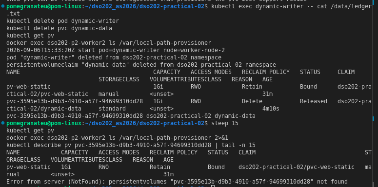

This confirms the `Delete` reclaim policy: the PV briefly passed through
`Released` while the provisioner performed asynchronous cleanup, then both
the PV object and the backing directory on `worker-node-2` were removed
entirely a few seconds later. This is the direct contrast with Stage 2's
`Retain` policy, where the PV stayed `Released` indefinitely and the data on
disk was untouched until deleted by hand. One field —
`reclaimPolicy` on the StorageClass — produced the entire difference.

**Checkpoint reached:** the reason the claim was initially `Pending` is
understood, the resize rejection was captured, and the node directory
confirmed gone after the claim's deletion.

---

### 3.4 Stage 4 — Why a Deployment Cannot Own State

**What was done.** A Deployment with three replicas was pointed at a single
shared PersistentVolumeClaim, to observe at first hand the failure modes a
StatefulSet is designed to prevent, before StatefulSets were introduced.

```
$ kubectl apply -f manifests/08-deployment-shared-pvc.yaml
$ kubectl rollout status deployment/shared-writer --timeout=180s
$ kubectl get pods -l app=shared-writer -o custom-columns=NAME:.metadata.name,NODE:.spec.nodeName
```

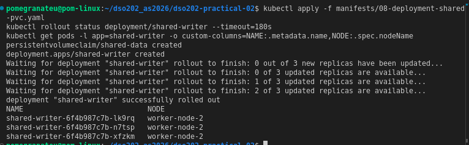

**Observation 1.** All three replicas were scheduled onto `worker-node-2`,
although the Deployment expresses no node preference anywhere. The claim was
bound to a volume that exists on one node only, so no other node could
accept these Pods — a storage decision removed the scheduler's freedom.

```
$ kubectl exec deploy/shared-writer -- cat /data/visitors.log
```

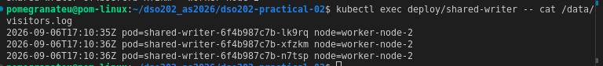

**Observation 2.** There is one set of data, not three. All three replicas
wrote into the same file on the same volume. A stateless web server can
tolerate this; two database processes writing to the same data directory
would corrupt it. Nothing in the Deployment specification can give each
replica its own volume, because the claim is named once in the Pod template
and every replica uses that template.

```
$ kubectl delete pod -l app=shared-writer --field-selector status.phase=Running --wait=false
$ sleep 15
$ kubectl get pods -l app=shared-writer -o custom-columns=NAME:.metadata.name
```

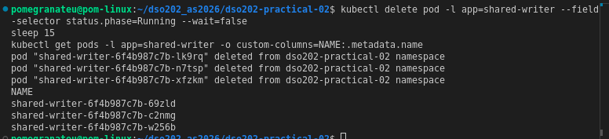

**Observation 3.** No replica retained an identity across the restart —
every Pod name is new. There is no way for an application, a monitoring
system, or a peer Pod to refer to "the first replica" and mean the same
process before and after deletion. Replicated databases require exactly
that continuity, because members must find each other by a name that
outlasts any individual Pod.

```
$ kubectl delete -f manifests/08-deployment-shared-pvc.yaml
$ kubectl get pvc
```

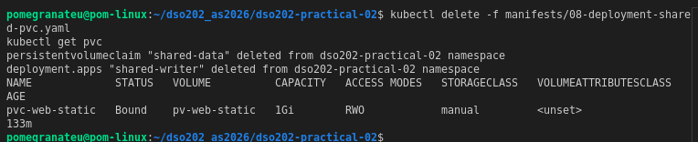

This confirms the anti-pattern Deployment and its claim were fully removed,
leaving only the Stage 2 static claim behind.

**Checkpoint reached:** all three observations recorded above, each with
supporting command output.

---

### 3.5 Stage 5 — StatefulSets and Stable Identity

**What was done.** A headless Service was created ahead of the StatefulSet
so that Pods are addressable from the moment they become ready. The
`webnote` StatefulSet was then applied and its ordered creation, per-ordinal
storage, per-Pod DNS, volume privacy, and survival of identity/storage
across Pod deletion were each verified in turn.

```
$ kubectl apply -f manifests/09-service-webnote.yaml
$ kubectl get service webnote
```

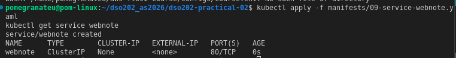

This confirms the Service is headless (`CLUSTER-IP: None`) — no virtual
address is allocated; the Service exists purely to publish DNS records.

```
$ kubectl apply -f manifests/10-statefulset-webnote.yaml
$ kubectl get pods -l app=webnote -w
```

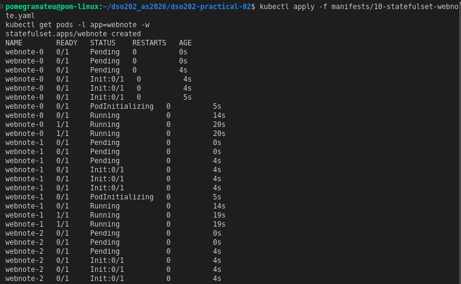

This confirms ordered, sequential creation (`OrderedReady`, the default):
`webnote-1` was not created until `webnote-0` reached `1/1 Running`, and
`webnote-2` waited on `webnote-1` in turn. Pod names are fixed ordinals
(`webnote-0`, `-1`, `-2`), not random hash suffixes.

```
$ kubectl get pvc -l app=webnote
```

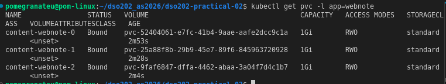

This confirms three separate claims were generated from the single
`volumeClaimTemplate`, named `<template>-<statefulset>-<ordinal>`, and are
selectable by label because the template sets labels under
`volumeClaimTemplates[].metadata`.

```
$ kubectl get pods -l app=webnote -o custom-columns=NAME:.metadata.name,NODE:.spec.nodeName,IP:.status.podIP
```

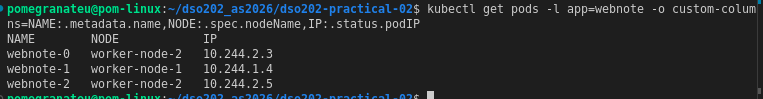

This confirms placement is free again, unlike Stage 4: the three Pods are
spread across both worker nodes because each ordinal owns its own volume
rather than sharing one.

```
$ kubectl apply -f manifests/11-pod-client.yaml
$ kubectl exec client -- nslookup webnote.dso202-practical-02.svc.cluster.local
```

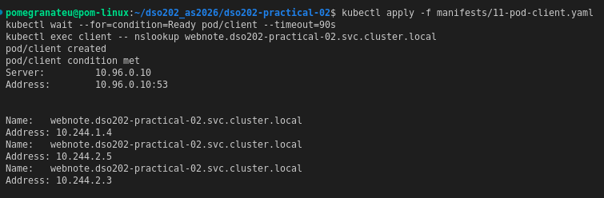

This confirms one Service name resolved to all three Pod addresses — a
headless Service publishes per-Pod DNS records instead of a single virtual
ClusterIP.

```
$ kubectl exec client -- wget -qO- http://webnote-1.webnote.dso202-practical-02.svc.cluster.local
```

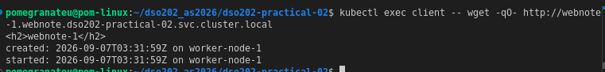

This confirms one specific Pod (`webnote-1`) is individually addressable by
its own DNS name, distinct from the address of the set as a whole.

```
$ kubectl exec webnote-0 -- sh -c 'echo "note added by hand in Stage 5" >> /usr/share/nginx/html/index.html'
$ kubectl exec client -- wget -qO- http://webnote-0.webnote.dso202-practical-02.svc.cluster.local
$ kubectl exec client -- wget -qO- http://webnote-1.webnote.dso202-practical-02.svc.cluster.local
```

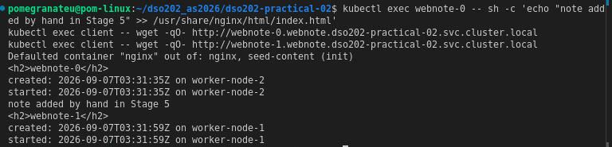

This confirms the volumes are genuinely private: a note written by hand
into `webnote-0`'s file appears only on `webnote-0`; `webnote-1` is
untouched. Three replicas of one workload hold three unrelated sets of
content — exactly what Stage 4 could not achieve.

```
$ kubectl delete pod webnote-1
$ kubectl wait --for=condition=Ready pod/webnote-1 --timeout=120s
$ kubectl get pod webnote-1 -o custom-columns=NAME:.metadata.name,NODE:.spec.nodeName,IP:.status.podIP
$ kubectl get pvc content-webnote-1
$ kubectl exec client -- wget -qO- http://webnote-1.webnote.dso202-practical-02.svc.cluster.local
```

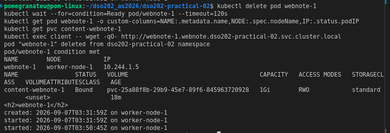

This confirms all four facts the guide highlights at once: the Pod name is
unchanged (`webnote-1`); the same claim was reattached rather than recreated
(its age, 18m, exceeds the replacement Pod's age); the `created:` timestamp
is untouched, so the file was not regenerated; and the Pod's IP address
changed (`10.244.1.4` → `10.244.1.5`), which is precisely why an application
must be configured with the DNS name and never with an address.

**Checkpoint reached:** all four StatefulSet guarantees (stable name, stable
storage, stable network identity, ordered operations) each matched to
specific command output above.

---

### 3.6 Stage 6 — Scaling, Retention, and Ordered Updates

**What was done.** The `webnote` StatefulSet was scaled up, then down, then
back up, to observe what happens to generated claims at each step. A
partitioned rolling update was carried out by editing the committed manifest
(rather than `kubectl patch`), first updating a single ordinal, then
completing the rollout across the rest. Finally the StatefulSet itself was
deleted and recreated to observe the `whenDeleted` retention policy.

```
$ kubectl scale statefulset webnote --replicas=4
$ kubectl wait --for=condition=Ready pod/webnote-3 --timeout=120s
$ kubectl get pvc -l app=webnote --no-headers | wc -l
```

This confirms scaling up created storage automatically: a fourth claim
(`content-webnote-3`) was generated from the same `volumeClaimTemplate` the
moment the fourth replica was requested.

```
$ kubectl scale statefulset webnote --replicas=2
$ kubectl get pods -l app=webnote -w
```

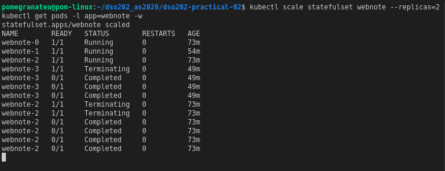

This confirms termination proceeded in descending ordinal order, one Pod at
a time: `webnote-3` was removed first, then `webnote-2`, leaving `webnote-0`
and `webnote-1` (the lowest ordinals) running. This ordering is what a
database designating ordinal 0 as its initial primary would depend on.

```
$ kubectl get pvc -l app=webnote
```

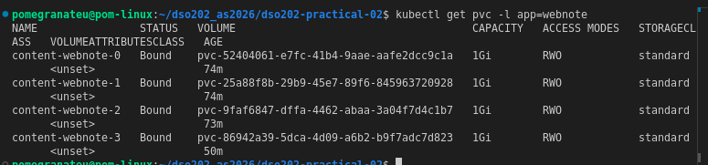

This confirms two Pods were running but all four claims remained. The
default `whenScaled: Retain` policy kept the data of the removed replicas —
scaling down is often a reaction to a problem, so destroying data as a side
effect would be unrecoverable.

```
$ kubectl scale statefulset webnote --replicas=3
$ kubectl wait --for=condition=Ready pod/webnote-2 --timeout=120s
$ kubectl exec client -- wget -qO- http://webnote-2.webnote.dso202-practical-02.svc.cluster.local
```

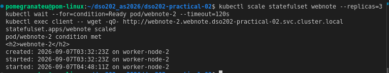

This confirms the original `created:` timestamp (`03:32:23`) survived:
ordinal 2 was deleted and later recreated, and it reclaimed the volume that
belonged to ordinal 2 purely by name. Identity is what links a replica to
its data, and the ordinal is the identity.

```
# manifests/10-statefulset-webnote.yaml edited: partition 0 -> 2,
# image nginx:1.30-alpine -> nginx:1.31-alpine (nginx container only)

$ kubectl apply -f manifests/10-statefulset-webnote.yaml
$ sleep 30
$ kubectl get pods -l app=webnote -o custom-columns=NAME:.metadata.name,IMAGE:.spec.containers[0].image
```

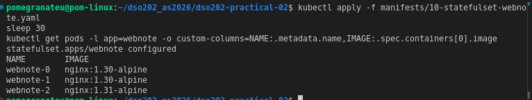

This confirms `partition: 2` restricted the update to Pods whose ordinal is
≥ 2. Only `webnote-2` picked up the new image; ordinals 0 and 1 were left
untouched, demonstrating how a new version can be trialled on a single
member before the rest of the set is committed to it — a capability with no
equivalent in a Deployment.

```
# manifests/10-statefulset-webnote.yaml edited: partition 2 -> 0

$ kubectl apply -f manifests/10-statefulset-webnote.yaml
$ kubectl rollout status statefulset/webnote --timeout=300s
$ kubectl get pods -l app=webnote -o custom-columns=NAME:.metadata.name,IMAGE:.spec.containers[0].image
```

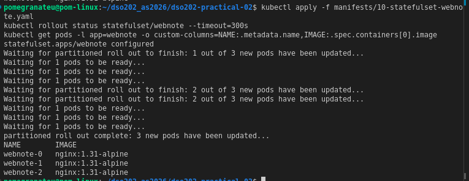

This confirms the remaining Pods were updated in descending order (ordinal
1, then ordinal 0), completing the rollout.

```
$ kubectl exec client -- wget -qO- http://webnote-0.webnote.dso202-practical-02.svc.cluster.local
```

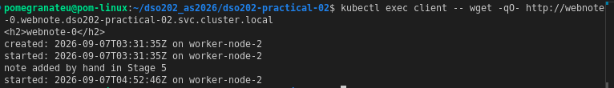

This confirms each replacement Pod reattached its own volume during the
image upgrade: the original `created:` timestamp and the hand-written note
from Stage 5 both survived, proving the rolling update changed only the
container image, not the data.

```
$ kubectl delete statefulset webnote
$ kubectl get pods -l app=webnote
# ~15s later:
$ kubectl get pods -l app=webnote
$ kubectl get pvc -l app=webnote --no-headers | wc -l
```

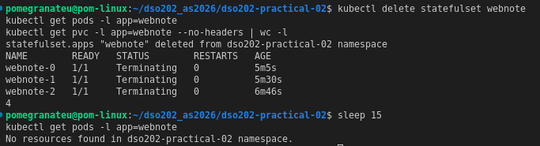

This confirms every Pod was removed by deleting the StatefulSet, but all
four claims remained, because `whenDeleted: Retain` is set. On this cluster,
deleting a StatefulSet is a recoverable mistake.

```
$ kubectl apply -f manifests/10-statefulset-webnote.yaml
$ kubectl rollout status statefulset/webnote --timeout=300s
$ kubectl exec client -- wget -qO- http://webnote-1.webnote.dso202-practical-02.svc.cluster.local
```

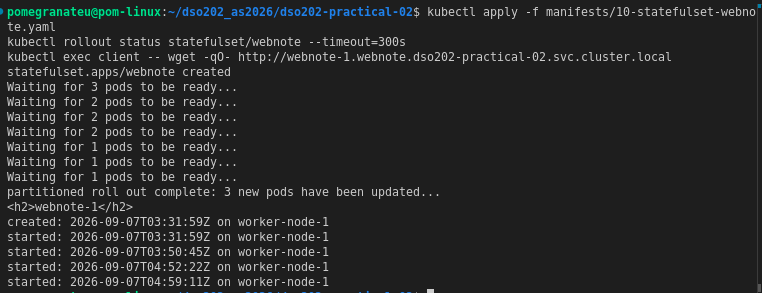

This confirms the workload returned with its complete history intact: the
original Stage 5 `created:` timestamp, and a `started:` line for every
restart, scale event, and the StatefulSet's own deletion and recreation —
none of which touched the underlying volumes.

**Checkpoint reached:** four claims exist, all three Pods run
`nginx:1.31-alpine`, and the effect of both retention-policy fields
(`whenScaled: Retain`, `whenDeleted: Retain`) is demonstrated directly from
observation.

---

### 3.7 Stage 7 — A Real Stateful Application: PostgreSQL

**What was done.** Database credentials were supplied via a Secret, two
Services (headless and ClusterIP) were created for the database, and a
single-replica PostgreSQL StatefulSet was deployed on the `dso202-retain`
StorageClass. A table was created and rows inserted, the database Pod was
then deleted to test whether the data survived, and both database-facing DNS
names were confirmed to resolve.

```
$ kubectl apply -f manifests/12-secret-postgres.yaml
$ kubectl get secret postgres-credentials
```

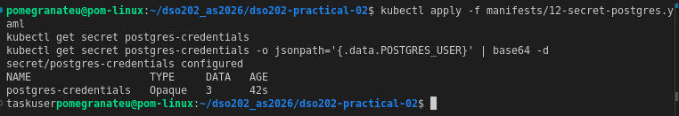

This confirms the Secret was created holding three keys, and that any
account able to read Secrets in this namespace can trivially recover the
plaintext value with one command — demonstrating that a Secret is
base64-encoded, not encrypted, and keeps credentials out of the manifest
only.

```
$ kubectl apply -f manifests/13-service-postgres.yaml
$ kubectl get services
```

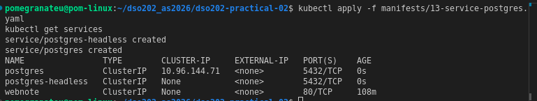

This confirms both database Services exist: `postgres-headless` (no virtual
address) gives the database Pod its stable per-Pod DNS name and is named in
the StatefulSet's `serviceName` field; `postgres` is an ordinary ClusterIP
Service, the name an application's connection string would use, so the
application need not know how many replicas exist.

```
$ kubectl apply -f manifests/14-statefulset-postgres.yaml
$ kubectl get pods -l app=postgres -w
```

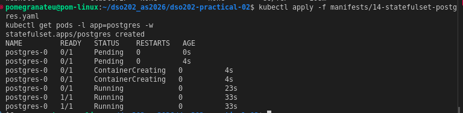

This confirms the Pod took roughly 33 seconds between `ContainerCreating`
and `1/1 Running` — the gap during which the readiness probe (`pg_isready`)
waited for PostgreSQL to finish initialising its data directory before
accepting connections.

```
$ kubectl logs postgres-0 | tail -n 4
$ kubectl get pvc data-postgres-0
```

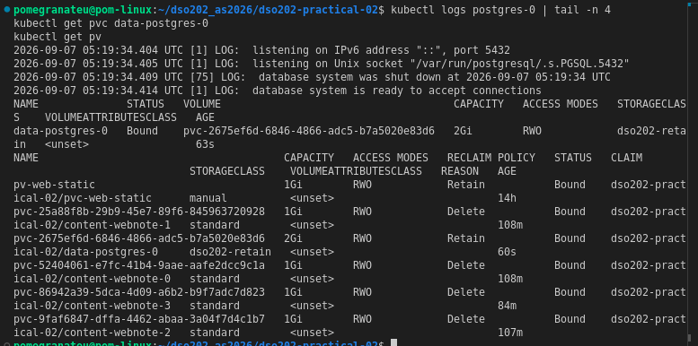

This confirms the database's claim used the `dso202-retain` class (2Gi),
not the default `standard` class used by `webnote` — the standard
production choice for a database, so that an accidental `kubectl delete
pvc` cannot destroy the data outright; it is left `Released` instead.

```
$ kubectl exec postgres-0 -- sh -c 'echo "$PGDATA"; ls /var/lib/postgresql'
```

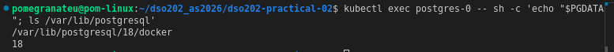

This confirms the PostgreSQL 18 image places its data directory in a
version-numbered subdirectory of the mounted volume, not at the mount point
itself. The manifest mounts the volume at `/var/lib/postgresql`, one level
above `$PGDATA`, which is why `initdb` was able to run without complaint —
mounting directly at the data directory would have caused it to refuse a
non-empty directory.

```
$ kubectl exec postgres-0 -- psql -U taskuser -d tasktracker -c \
  "CREATE TABLE tasks (id serial PRIMARY KEY, title text NOT NULL, done boolean NOT NULL DEFAULT false, created_at timestamptz NOT NULL DEFAULT now());"

$ kubectl exec postgres-0 -- psql -U taskuser -d tasktracker -c \
  "INSERT INTO tasks (title) VALUES ('Complete Practical 2'), ('Read Unit II notes'), ('Draft the report');"

$ kubectl exec postgres-0 -- psql -U taskuser -d tasktracker -c \
  "SELECT id, title, done FROM tasks ORDER BY id;"
```

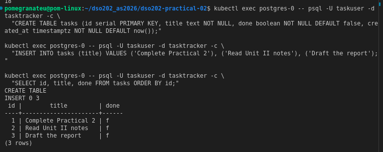

This confirms a table was created and three rows inserted successfully.

```
$ kubectl delete pod postgres-0
$ kubectl wait --for=condition=Ready pod/postgres-0 --timeout=180s
$ kubectl exec postgres-0 -- psql -U taskuser -d tasktracker -c "SELECT count(*) FROM tasks;"
```

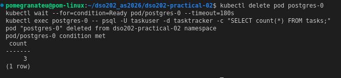

This is the central result of the practical: three rows, written by a
process that no longer existed, were read back through a replacement Pod
that did not exist at the time they were written. The data lived on the
volume, independent of the Pod's lifetime.

```
$ kubectl logs postgres-0 | head -n 8
```

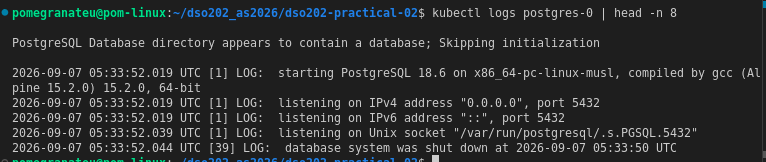

This confirms initialisation was skipped, because the data directory already
existed on the reattached volume, and the shutdown was clean (no recovery
message), consistent with the Pod having been terminated gracefully within
its `terminationGracePeriodSeconds`.

```
$ kubectl get pvc data-postgres-0
$ kubectl exec client -- nslookup postgres.dso202-practical-02.svc.cluster.local
$ kubectl exec client -- nslookup postgres-0.postgres-headless.dso202-practical-02.svc.cluster.local
```

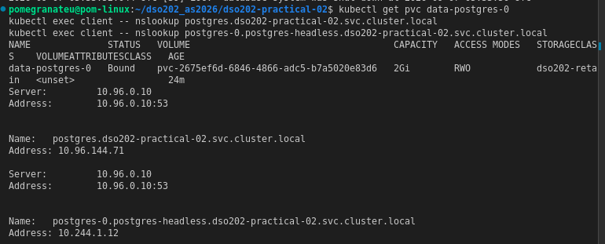

This confirms the claim's age (24m) spans the Pod deletion, proving it was
reused rather than recreated. Both database-facing DNS names resolve: the
ClusterIP Service name (`postgres`) returns the stable virtual address an
application would put in its configuration; the headless per-Pod name
(`postgres-0.postgres-headless...`) returns the Pod's own address directly,
which a backup job or replication peer would use to reach that specific
instance.

**Checkpoint reached:** `SELECT count(*)` returned 3 after the Pod was
deleted and replaced, and both PostgreSQL Service names resolved correctly.

---

### 3.8 Stage 8 — Cleanup, and the Cost of Retain

**What was done.** Evidence was captured before any teardown, including a
logical `pg_dump` of the database — a genuine backup, unlike a retained
volume. All workloads were then deleted, exposing the claims that
`kubectl delete -f manifests/` never touches because they were generated by
`volumeClaimTemplates` rather than written in any file. The claims were
deleted explicitly to watch the two reclaim policies diverge, the released
volumes were reclaimed by hand, and finally the cluster itself was deleted
to demonstrate the final asymmetry between node-local dynamic storage and
the statically provisioned host directory.

```
$ mkdir -p evidence
$ kubectl get all -o wide > evidence/final-state-all.txt
$ kubectl get pv,pvc,storageclass -o wide > evidence/final-state-storage.txt
$ kubectl get statefulset webnote -o yaml > evidence/final-statefulset-webnote.yaml
$ kubectl get events --sort-by=.lastTimestamp > evidence/final-state-events.txt
$ kubectl exec postgres-0 -- pg_dump -U taskuser -d tasktracker > evidence/tasktracker-dump.sql

$ wc -l evidence/tasktracker-dump.sql
100 evidence/tasktracker-dump.sql
```

This confirms a full snapshot of the cluster state was captured, and that
the SQL dump is non-empty (100 lines) — a logical backup held outside the
cluster, in contrast to a retained volume which is not a backup.

```
$ kubectl delete -f manifests/14-statefulset-postgres.yaml
$ kubectl delete -f manifests/10-statefulset-webnote.yaml
$ kubectl delete -f manifests/11-pod-client.yaml
$ kubectl delete -f manifests/05-pod-static-writer.yaml
$ kubectl get pods
```


This confirms every workload was removed cleanly.

```
$ kubectl get pvc

```


This confirms six claims were still present after every workload was
deleted, holding storage for controllers that no longer existed. Claims
generated from a `volumeClaimTemplate` are never removed by
`kubectl delete -f`, because they were never written in any manifest file.

```
$ kubectl delete pvc --all
$ kubectl get pv

# ~15 seconds later:
$ kubectl get pv
```


This confirms all six claims were deleted at once, and — as in Stage 3 — the
`Delete`-class volumes were only briefly `Released` before the
`local-path-provisioner`'s asynchronous cleanup removed them entirely a few
seconds later. The two `Retain`-class volumes (the static PV and the
PostgreSQL PV) remained `Released` indefinitely, still holding all of their
data, including the entire `tasks` table.

```
$ kubectl delete pv pv-web-static
$ kubectl delete pv pvc-2675ef6d-6846-4866-adc5-b7a5020e83d6
$ kubectl get pv

$ docker exec dso202-p2-worker ls /var/local-path-provisioner 2>&1

$ docker exec dso202-p2-worker2 ls /var/local-path-provisioner 2>&1
```


This confirms deleting the PV objects removed only the API objects: the
PostgreSQL data directory was still physically present on `worker-node-2`
afterward. Storage released by Kubernetes remains occupied until an
administrator removes it deliberately — in a cloud environment, the
difference between a deleted cluster and a continuing invoice.

```
$ kubectl config set-context --current --namespace=default
$ kind delete cluster --name dso202-p2
$ kind get clusters
```


This confirms the cluster and all three nodes were removed entirely.

```
$ ls -l /tmp/dso202-p2-storage/pv-web-static/
```


This is the sharpest illustration in the whole practical of what a
PersistentVolume object actually is. The cluster is gone, the nodes are
gone, and every dynamically provisioned volume went with them — including
the PostgreSQL data, because it lived inside a node. The statically
provisioned `ledger.txt`, by contrast, is still present on the host,
because it never lived inside the cluster at all: a PersistentVolume is a
description of storage, never the storage itself.

**Checkpoint reached:** the evidence directory holds the pre-cleanup state
and the SQL dump; four standard-class volumes were confirmed removed while
two retain-class volumes were confirmed released and then manually
reclaimed; the cluster was deleted; and the static host data was confirmed
to have survived every deletion above it.

---

## 4. Analysis

Review questions answered, numbered per the guide's section 16:

**Q1. The claim in Stage 3 was Pending immediately after creation, while the
claim in Stage 2 bound at once. Name the single field responsible for the
difference and explain the reasoning behind that field's design.**

The field is `volumeBindingMode` on the StorageClass. The Stage 2 claim
named `storageClassName: manual`, which matches no actual StorageClass
object, so no binding mode applied at all — the claim bound as soon as a
matching `Available` PV existed. The Stage 3 claim named `standard`, whose
`volumeBindingMode` is `WaitForFirstConsumer`. This mode exists so the
provisioner does not have to guess which node a volume should be created on;
it waits until a Pod referencing the claim has been scheduled, then creates
the volume on that Pod's node. Binding immediately (the alternative,
`Immediate`) risks creating storage on a node the eventual Pod cannot be
placed on.

**Q2. After the claim was deleted, the data from Stage 2 survived and the
data from Stage 3 did not. State which object carried the field that
decided this, and who in a real organisation would have chosen its value.**

The field is `reclaimPolicy` (or, on a statically-created PV,
`persistentVolumeReclaimPolicy`), carried on the PersistentVolume — but for
dynamically provisioned volumes, its value is inherited from the
StorageClass that created the PV, not chosen per-claim. Stage 2's manually
created PV set `Retain`. Stage 3's PV was created by the `standard` class,
which sets `Delete`. In a real organisation, the StorageClass's
`reclaimPolicy` would be set by a platform or infrastructure administrator
when the class is defined — a decision made long before any application
team creates a claim against it, and one a developer writing a PVC manifest
cannot override.

**Q3. In Stage 4 all three replicas were scheduled onto one node although
the Deployment expressed no node preference. Explain the mechanism, and
state what would have happened instead on a managed cloud cluster using a
zonal disk.**

The mechanism is indirect: the Deployment's Pod template names a single
PersistentVolumeClaim, and that claim was bound to a PersistentVolume backed
by a `hostPath` directory that exists on exactly one node. The scheduler
must place every Pod that mounts a bound `ReadWriteOnce` volume on a node
that can actually reach that volume, so all three replicas were forced onto
the one node the volume lived on — the constraint came from storage, not
from any affinity rule written into the Deployment. On a managed cloud
cluster, the equivalent claim would bind to a network disk (a zonal
resource, attachable to only one node at a time). The first replica
scheduled there would attach the disk normally, but the other two replicas
— if the scheduler placed them on different nodes, which it is free to do
without a storage constraint pinning them — would fail to start, reporting
a multi-attach error, because a `ReadWriteOnce` network disk cannot be
attached to more than one node simultaneously. This cluster hid that failure
because `ReadWriteOnce` on `hostPath` storage permits several Pods on the
*same* node to mount it at once, which is exactly what happened here.

**Q4. Give the fully qualified DNS name of the second replica of the
webnote StatefulSet, and name every object that must exist for it to
resolve.**

The fully qualified DNS name is:

```
webnote-1.webnote.dso202-practical-02.svc.cluster.local
```

For this name to resolve, the following objects must all exist: the Pod
`webnote-1` itself, and it must be Ready (an unready Pod is removed from
the headless Service's DNS records unless `publishNotReadyAddresses` is
set); the headless Service `webnote` (`clusterIP: None`), which is what
causes per-Pod DNS records to be published at all; the StatefulSet
`webnote`, whose `serviceName` field must name that Service exactly, since
a mismatch here is what typically causes the per-Pod name to fail to
resolve although the Pods themselves are healthy; and the namespace
`dso202-practical-02`, which forms part of the fully qualified name itself.

**Q5. The StatefulSet was scaled from four replicas to two and back to
three. Describe what happened to the claims at each step, name the two
fields that governed it, and state their default values.**

Scaling down from four replicas to two did not remove any claims: all four
`content-webnote-*` claims remained `Bound`, because `whenScaled` was set to
(and defaults to) `Retain` — the data belonging to a removed replica survives
a scale-down. Scaling back up to three replicas did not create a new claim
for ordinal 2; instead, the StatefulSet controller recreated `webnote-2` and
reattached the existing `content-webnote-2` claim by name, so the original
`created:` timestamp inside that volume's file was preserved. The two
governing fields both live under
`spec.persistentVolumeClaimRetentionPolicy`: `whenScaled` (governs claims
belonging to ordinals removed by scaling down) and `whenDeleted` (governs
claims belonging to the whole set when the StatefulSet object itself is
deleted). Both default to `Retain`.

**Q6. Listing 16 mounts the volume at `/var/lib/postgresql` rather than at
the data directory. Explain why, and describe the failure that mounting at
the data directory would produce on a volume that is not empty.**

From PostgreSQL 18 onward, the official image places its actual data
directory in a version-numbered subdirectory,
`/var/lib/postgresql/18/docker`, and expects `/var/lib/postgresql` itself to
be the mount point. `initdb` (the PostgreSQL initialisation process) refuses
to initialise a directory that is not empty. A freshly provisioned volume
can contain entries placed there by the storage driver itself (for example,
a `lost+found` directory on some filesystems, or provisioner metadata), so a
volume that is technically "empty" of application data may not be
byte-for-byte empty. Mounting the volume directly at the data directory
therefore risks `initdb` finding a non-empty directory and refusing to
start, which surfaces as the container entering `CrashLoopBackOff` on its
very first start, with the log reporting that the data directory exists but
is not empty. Mounting one level above the data directory, at
`/var/lib/postgresql`, avoids this: the version-numbered subdirectory itself
is created fresh by the image's own entrypoint script inside the volume.

**Q7. State two things a StatefulSet does not provide for a database, and
name the Kubernetes mechanism or the software category that provides each
in production.**

First, a StatefulSet does not replicate data: three replicas of the same
StatefulSet spec produce three independent volumes holding three unrelated
sets of data, which was demonstrated directly in this practical by the
single-replica PostgreSQL StatefulSet (a genuine multi-node PostgreSQL
cluster would require the database's own replication and failover logic
running on top of a StatefulSet). This capability is provided in production
by an Operator — purpose-built software (for example the Crunchy Postgres
Operator or Patroni-based operators) that manages leader election, ongoing
replication, and failover for the specific database. Second, a StatefulSet
does not perform backup: a volume that survives Pod deletion is not
protection against a dropped table or an accidental `DELETE FROM`, because
the same mistake that destroys the live data is replayed on the volume
regardless of the StatefulSet's guarantees. This is provided instead by a
logical dump mechanism such as `pg_dump` (as captured in Stage 8, held
outside the cluster) or, more generally, a scheduled backup/snapshot system
independent of the running Pod.

**Q8. After the claims were deleted in Stage 8, two PersistentVolumes
reported `Released`. Explain why the phase was not `Available`, and state
what an administrator must do to return that storage to service.**

The phase was `Released` rather than `Available` because both volumes
(`pv-web-static` and the PostgreSQL PV) had their `reclaimPolicy` set to
`Retain`. Kubernetes will not silently return a volume that may still hold
one workload's data to `Available` for a completely different claim to bind
to — doing so could hand one tenant's data to another. Instead the volume
is marked `Released`: the claim that used to bind it is gone, but the
volume, and the directory it describes, are left exactly as they were. To
return the storage to service, an administrator must act deliberately: in
this practical, the PV objects were deleted outright with `kubectl delete
pv`, which removed the API objects but left the backing directories on the
nodes untouched (confirmed by `docker exec ... ls /var/local-path-provisioner`
still showing the PostgreSQL directory afterward). In general, an
administrator returning a `Released` volume to service without deleting it
would instead need to clear its `claimRef` field explicitly, at which point
it becomes `Available` again for a new claim to bind — a manual step by
design, since the alternative would risk exposing old data to a new
workload automatically.

---

## 5. Reflection

**What was difficult.** The most instructive difficulty in this practical
was not a Kubernetes concept but a timing detail: after deleting a claim
bound to a `Delete`-reclaim-policy volume (both in Stage 3 and again in
Stage 8), `kubectl get pv` briefly reported the volume as `Released` before
it disappeared entirely a few seconds later. On first encountering this in
Stage 3, it looked like the reclaim policy had silently changed to `Retain`,
since the guide's own transcript shows the volume disappearing immediately.
Re-running `kubectl get pv` after a short `sleep` resolved it: the
`local-path-provisioner` performs its cleanup of the node directory
asynchronously, so there is a real (if brief) window in which a
`Delete`-class volume sits at `Released` exactly like a `Retain`-class one.
The practical lesson is that `Released` on its own does not tell you which
reclaim policy is in effect — only whether the object is still present a few
seconds later does.

**Error encountered and how it was diagnosed.** During the Stage 6
partitioned rollout, the first attempt to identify which `image:` line to
edit in `manifests/10-statefulset-webnote.yaml` targeted the wrong
container — the file has two `image:` fields, one for the `busybox` init
container (`seed-content`) and one for the `nginx` container, and only the
latter should have been changed to `nginx:1.31-alpine`. This was diagnosed
with `grep -n "nginx:" manifests/10-statefulset-webnote.yaml` to locate the
exact line before editing, and confirmed afterward with `kubectl get pods -l
app=webnote -o custom-columns=NAME:.metadata.name,IMAGE:.spec.containers[0].image`,
which showed only `webnote-2` on the new image while ordinals 0 and 1
remained on `nginx:1.30-alpine` — matching the expected partitioned-update
behaviour exactly.

**What would be done differently.** Given how often this practical requires
distinguishing "the object is gone" from "the object is momentarily in an
intermediate phase," a short `sleep` (or a `kubectl get pv -w` watch instead
of a single snapshot) would be built into the reclaim-policy verification
steps from the start, rather than re-running the command a second time
after an unexpected result.

**One thing that remains unclear.** The guide states that `maxUnavailable`
for StatefulSet rolling updates has reached beta status, and that
Kubernetes v1.36 introduced a further update strategy in alpha for rollouts
that stall on a Pod that never becomes Ready. Neither was exercised in this
practical (the cluster used the default one-at-a-time `RollingUpdate`
throughout), so it remains unclear from direct observation how either
alternative changes the ordering guarantees demonstrated in Stage 6 —
this would be worth checking with `kubectl explain
statefulset.spec.updateStrategy.rollingUpdate` against this specific
cluster version in a follow-up session.

---

## 6. References

- DSO202 Practical 2 Guide (`DSO202_Practical2_Guide.md`), sarojsanyasi, HackMD.
- DSO202 Practical 2 Companion File (`DSO202_Practical2_Manifests.md`),
  sarojsanyasi, HackMD.
- `kubectl explain` output consulted directly against the running cluster
  for field-level questions (see companion file Appendix C).