# DSO202 — Practical 3: Environment-Specific Configuration with Kustomize on Kind

| | |
|---|---|
| **Name** | Pema Tshering Yangchen |
| **Student ID** | 2230295 |
| **Module** | DSO202 — Scaling, Orchestration, Monitoring & Observability |
| **Practical** | 03 — Environment-Specific Configuration with Kustomize |
| **Repository** | `dso202_as2026/dso202-practical-03` |
| **Date** | 29 September 2026 |

---

## 1. Objectives

By the end of this practical, I aimed to:

- render a Kustomize base and multiple overlays;
- deploy dev, staging and prod without copying the base Deployment or Service;
- use `namespace`, `labels`, `replicas`, generators and patches;
- observe how the ConfigMap hash suffix behaves when content changes;
- follow the safe workflow **render → diff → apply → verify**;
- diagnose Kustomize behaviour by reading rendered output.

---

## 2. Lab Environment

| Component | Value |
|---|---|
| Host OS | Pop!_OS (amd64) |
| Cluster | kind, cluster `dso202`, context `kind-dso202` |
| Nodes | `dso202-control-plane`, `dso202-worker`, `dso202-worker2` |
| Kubernetes (server) | v1.36.1 |
| kubectl (client) | v1.36.0 |
| Kustomize (built into kubectl) | v5.8.1 |
| Workload image | `nginx:1.27-alpine` |

### Lab topology

```
Kind cluster (dso202)
├── dso202-control-plane
├── dso202-worker
└── dso202-worker2

Namespaces created by overlays
├── webapp-dev
├── webapp-staging
├── webapp-prod
└── webapp-qa
```

---

## 3. Task 0 — Pre-flight

```bash
kind get clusters
kubectl config current-context
kubectl get nodes -o wide
kubectl version --client -o yaml
```

**Output (excerpt):**

```
dso202
kind-dso202
NAME                   STATUS   ROLES           AGE     VERSION
dso202-control-plane   Ready    control-plane   7d14h   v1.36.1
dso202-worker          Ready    <none>          7d14h   v1.36.1
dso202-worker2         Ready    <none>          7d14h   v1.36.1
...
gitVersion: v1.36.0
kustomizeVersion: v5.8.1
```

- The current context `kind-dso202` reaches the existing kind cluster.
- All three nodes (one control plane, two workers) are `Ready`.
- kubectl v1.36.0 bundles Kustomize v5.8.1, so `kubectl kustomize` and `kubectl apply -k` work without a separate install.

---

## 4. Task 1 — Read the Repository Before Running It

```bash
tree examples/webapp
```

```
examples/webapp/
├── base/
│   ├── deployment.yaml
│   ├── service.yaml
│   ├── index.html
│   └── kustomization.yaml
└── overlays/
    ├── dev/
    │   ├── index.html
    │   ├── kustomization.yaml
    │   └── namespace.yaml
    ├── staging/
    ├── prod/
    │   ├── ...
    │   └── patch-resources.yaml
    ├── qa/            (created in Task 9)
    └── sandbox/       (challenge extension)
```

**Which files exist only once for all environments?**
`base/deployment.yaml`, `base/service.yaml`, `base/kustomization.yaml` and the default `base/index.html`. The Deployment and Service are defined once and reused by every overlay.

**Which values differ between environments?**
The namespace, the `environment` label, the replica count, the page content (`index.html`), and in prod, the container resource limits and a `tier: production` annotation.

**Where are those differences represented?**
In each overlay's `kustomization.yaml` (`namespace:`, `labels:`, `replicas:`, `configMapGenerator` with `behavior: replace`), in each overlay's own `namespace.yaml` and `index.html`, and in prod's `patch-resources.yaml`.

---

## 5. Task 2 — Render the Base

```bash
kubectl kustomize examples/webapp/base
```

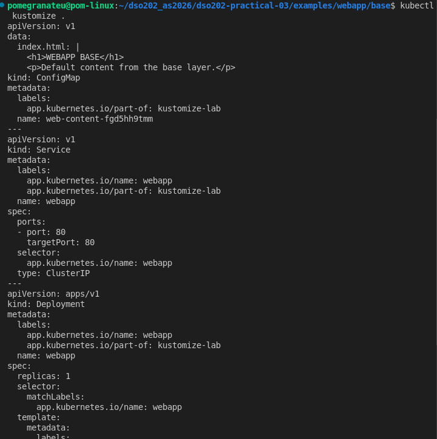

*Figure 1: Rendered base showing the generated ConfigMap, the Service and the Deployment.*

### Findings

| Item | Value |
|---|---|
| Generated ConfigMap | `web-content-fgd5hh9tmm` |
| Hash suffix | `fgd5hh9tmm` |
| Service | `webapp` (ClusterIP, port 80) |
| Deployment | `webapp`, 1 replica |
| Page content | `<h1>WEBAPP BASE</h1>` / "Default content from the base layer." |

The Deployment's `volumes[].configMap.name` is rewritten to `web-content-fgd5hh9tmm`, even though `base/deployment.yaml` refers to it simply as `web-content`.

### Checkpoint — Why the ConfigMap name is not exactly `web-content`

The `configMapGenerator` appends a hash of the ConfigMap's contents to its name. This makes a generated ConfigMap **immutable by name**: different content produces a different name. Kustomize then rewrites every reference to it, here the Deployment's volume, so the new name is used everywhere. Because the reference lives inside the pod template, a content change forces a rollout. A plain ConfigMap edited in place would leave running pods serving stale content.

---

## 6. Task 3 — Compare Dev and Prod Without Touching the Cluster

```bash
kubectl kustomize examples/webapp/overlays/dev  > /tmp/webapp-dev.yaml
kubectl kustomize examples/webapp/overlays/prod > /tmp/webapp-prod.yaml
diff -u /tmp/webapp-dev.yaml /tmp/webapp-prod.yaml || true
```

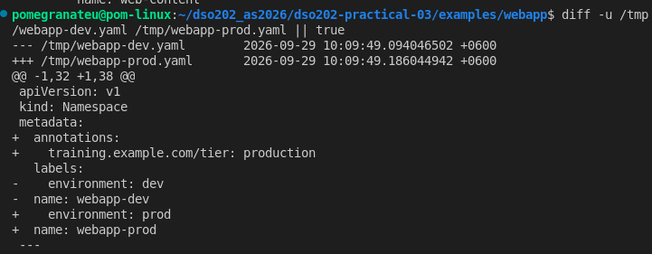

*Figure 3: Start of the dev/prod diff. Prod adds a `training.example.com/tier: production` annotation and changes the namespace and environment label.*

### Environment differences identified

| # | Category | Dev | Prod |
|---|---|---|---|
| 1 | Namespace | `webapp-dev` | `webapp-prod` |
| 2 | `environment` label | `dev` | `prod` |
| 3 | Annotation | none | `training.example.com/tier: production` |
| 4 | Replica count | 1 | 3 |
| 5 | Resource limits | `cpu: 100m`, `memory: 128Mi` (base) | `cpu: 250m`, `memory: 256Mi` (patched) |
| 6 | Generated web content | dev `index.html` | prod `index.html` |
| 7 | ConfigMap hash suffix | `fbk5dg98b8` | different (different content) |

### Principle

An overlay is valuable when you can explain the environment difference by reading a small number of lines instead of reviewing a complete duplicate manifest. Every difference above comes from a few lines in the prod overlay plus one small patch file.

---

## 7. Task 4 — Deploy Dev Safely

### Dev overlay `kustomization.yaml`

```yaml
apiVersion: kustomize.config.k8s.io/v1beta1
kind: Kustomization

namespace: webapp-dev

resources:
  - ../../base
  - namespace.yaml

labels:
  - pairs:
      environment: dev
    includeSelectors: false
    includeTemplates: true

replicas:
  - name: webapp
    count: 1

configMapGenerator:
  - name: web-content
    behavior: replace
    files:
      - index.html
```

### Step 1 — Render

```bash
kubectl kustomize examples/webapp/overlays/dev
```

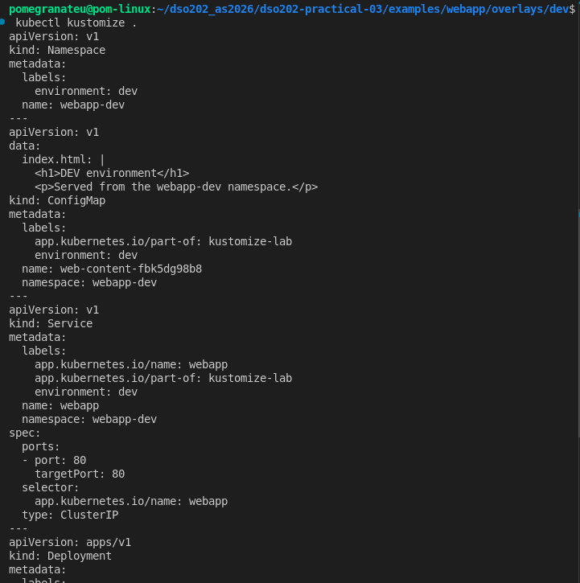

*Figure 2: Rendered dev overlay. The Namespace, the `environment: dev` label, the dev page content, the hashed ConfigMap `web-content-fbk5dg98b8` and `namespace: webapp-dev` on every object.*

### Step 2 — Diff

```bash
kubectl diff -k examples/webapp/overlays/dev || true
```

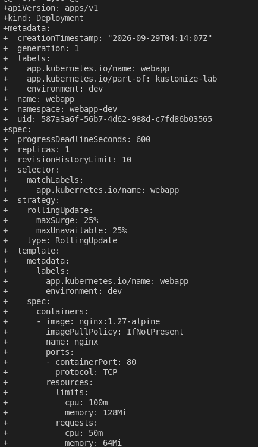

*Figure 4: `kubectl diff` shows the Deployment as entirely new (`+` lines), including the server-side defaults (strategy, `progressDeadlineSeconds`, `imagePullPolicy`) the API server would add.*

### Step 3 — Apply and verify

```bash
kubectl apply -k examples/webapp/overlays/dev
kubectl rollout status deployment/webapp -n webapp-dev
kubectl get all -n webapp-dev
kubectl get configmap -n webapp-dev
```

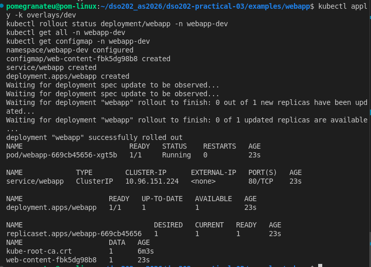

*Figure 5: Dev applied. ConfigMap `web-content-fbk5dg98b8`, Service `webapp` (ClusterIP 10.96.151.224), Deployment `webapp` 1/1, pod `webapp-669cb45656-xgt5b` Running.*

### Observations

- The Deployment keeps the base name `webapp`. The **namespace** separates environments, not the resource name.
- `includeSelectors: false` adds the `environment` label to metadata and pod templates but **not** to selectors. Deployment selectors are immutable, so keeping them stable avoids breaking future applies.

---

## 8. Task 5 — Reach the Application

```bash
kubectl port-forward -n webapp-dev service/webapp 8088:80
```

Local port `8088` was used instead of `8080`. The request was sent with Postman instead of `curl`; the result is the same HTTP GET.

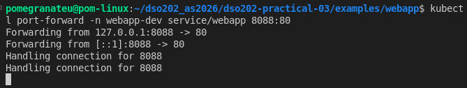

*Figure 7: Port-forward from `127.0.0.1:8088` to the Service's port 80, handling connections.*

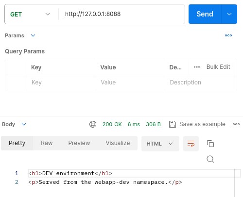

*Figure 6: `GET http://127.0.0.1:8088` returns `200 OK` with "DEV environment — Served from the webapp-dev namespace."*

The response comes from the dev `index.html`, which confirms that the overlay's `configMapGenerator` (`behavior: replace`) replaced the base content. The ConfigMap is mounted at `/usr/share/nginx/html`, NGINX's default web root.

---

## 9. Task 6 — Prove the ConfigMap Hash / Rollout Chain

### Before the change

```bash
kubectl get configmap -n webapp-dev
kubectl get pods -n webapp-dev -o wide
```

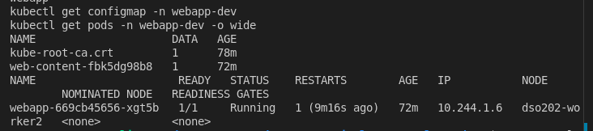

*Figure 8: Before. ConfigMap `web-content-fbk5dg98b8`, pod `webapp-669cb45656-xgt5b` on `dso202-worker2`.*

### Change made

Edited `examples/webapp/overlays/dev/index.html`:

```html
<h1>DEV v2 — configuration changed</h1>
```

### Render before applying

```bash
kubectl kustomize examples/webapp/overlays/dev | grep 'name: web-content'
```

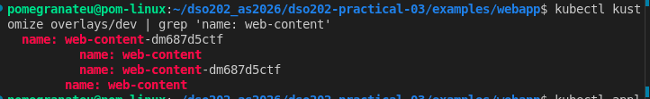

*Figure 9: The render already shows the new name `web-content-dm687d5ctf`, both on the ConfigMap and in the Deployment's volume reference, before anything touches the cluster.*

### Apply

```bash
kubectl apply -k examples/webapp/overlays/dev
kubectl rollout status deployment/webapp -n webapp-dev
```

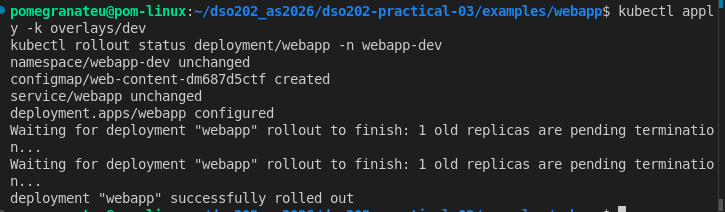

*Figure 10: Only two objects changed. `configmap/web-content-dm687d5ctf created` and `deployment.apps/webapp configured`. The Namespace and Service are `unchanged`. The rollout replaces the old replica.*

### After the change

```bash
kubectl get configmap -n webapp-dev
kubectl get pods -n webapp-dev -o wide
```

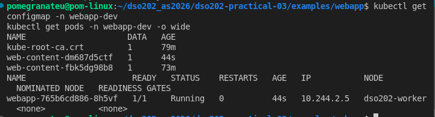

*Figure 11: After. Both ConfigMaps exist; the new pod `webapp-765b6cd886-8h5vf` runs on `dso202-worker`.*

### Evidence summary

| | Before | After |
|---|---|---|
| ConfigMap | `web-content-fbk5dg98b8` | `web-content-dm687d5ctf` (old one still present) |
| Pod | `webapp-669cb45656-xgt5b` | `webapp-765b6cd886-8h5vf` |
| ReplicaSet hash | `669cb45656` | `765b6cd886` |
| Node | `dso202-worker2` | `dso202-worker` |

### The chain, explained

```
file content changed
→ generated ConfigMap content changed
→ generated ConfigMap name hash changed
→ Deployment reference changed
→ Deployment pod template changed
→ rollout occurred
```

Editing `dev/index.html` changed the data inside the generated ConfigMap. Kustomize derives the name suffix from that data, so the ConfigMap got a new name, `fbk5dg98b8` → `dm687d5ctf` (Figure 9). Kustomize also rewrote the Deployment's volume to point at the new name. That volume is inside `spec.template`, so the pod template changed. Kubernetes treats any pod-template change as a new revision, so it created a new ReplicaSet (`669cb45656` → `765b6cd886`) with a new pod and terminated the old one (Figure 10).

The old ConfigMap `web-content-fbk5dg98b8` was **not** deleted (Figure 11), because `kubectl apply -k` does not prune resources that are no longer rendered. That orphan remains until the namespace is deleted or pruning is used.

---

## 10. Task 7 — Deploy Staging and Prod

```bash
kubectl diff -k examples/webapp/overlays/staging || true
kubectl apply -k examples/webapp/overlays/staging

kubectl diff -k examples/webapp/overlays/prod || true
kubectl apply -k examples/webapp/overlays/prod

kubectl rollout status deployment/webapp -n webapp-staging
kubectl rollout status deployment/webapp -n webapp-prod
kubectl get deploy -A -l app.kubernetes.io/name=webapp
kubectl get pods -A -l app.kubernetes.io/name=webapp -o wide
```

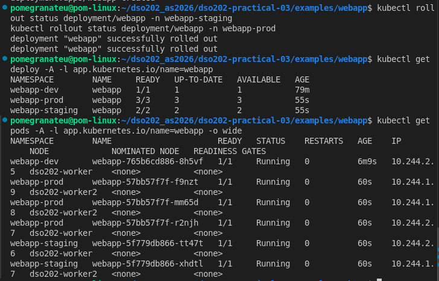

*Figure 12: Staging and prod rolled out. One label selector lists the `webapp` Deployment and pods across all three namespaces.*

### Replica counts by environment

| Environment | Namespace | Replicas | Pods placed on |
|---|---|---|---|
| dev | `webapp-dev` | 1 | `dso202-worker` |
| staging | `webapp-staging` | 2 | `dso202-worker`, `dso202-worker2` |
| prod | `webapp-prod` | 3 | `dso202-worker2` ×2, `dso202-worker` ×1 |
| qa (Task 9) | `webapp-qa` | 2 | `dso202-worker`, `dso202-worker2` |

### Observation

The same base Deployment named `webapp` runs in three namespaces at once with a different scale in each. Because every environment keeps the shared selector label `app.kubernetes.io/name=webapp` (`includeSelectors: false`), a single command lists them all. The scheduler spread each environment's replicas across both workers.

---

## 11. Task 8 — Inspect What the Prod Patch Changed

```bash
cat overlays/prod/patch-resources.yaml
kubectl kustomize overlays/prod | grep -A7 'resources:'
kubectl get deploy webapp -n webapp-prod \
  -o jsonpath='{.spec.template.spec.containers[0].resources}'; echo
```

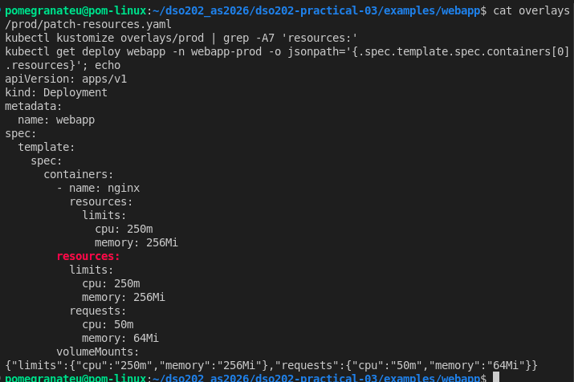

*Figure 13: The patch sets only `limits`; the render and the live object have the patched limits **plus** the base `requests`.*

### Comparison with the base

| | Base (seen in dev/qa) | Prod (after patch) |
|---|---|---|
| `limits.cpu` | 100m | **250m** |
| `limits.memory` | 128Mi | **256Mi** |
| `requests.cpu` | 50m | 50m (kept from base) |
| `requests.memory` | 64Mi | 64Mi (kept from base) |

### Questions

**Were the base resource values deleted entirely or merged?**
They were **merged**. `patch-resources.yaml` is a strategic merge patch. Kustomize matched the container by its merge key (`name: nginx`) and replaced only the field the patch specified (`limits`). The base `requests`, image, ports and `volumeMounts` all remained, as the rendered output and the live jsonpath result in Figure 13 show.

**Which environment owns the production-specific resource policy?**
The **prod overlay**, through `overlays/prod/patch-resources.yaml`. No other environment is affected. The QA Deployment (Figure 15) still runs the base limits of `100m`/`128Mi`.

**Why is a patch better than copying `deployment.yaml` into `prod/`?**
The patch is about a dozen lines and states only what is different in production. A copied Deployment would duplicate the image, ports, volumes and labels. Every later base change would then need manual syncing into the prod copy, and the two could drift apart unnoticed. With a patch, prod's differences are reviewable at a glance, and base improvements reach every environment automatically.

---

## 12. Task 9 — Create a QA Overlay

### Requirements checklist

| Requirement | Implemented via | Status |
|---|---|---|
| Namespace `webapp-qa` | `namespace:` + `namespace.yaml` | ✅ |
| Replicas: 2 | `replicas:` transformer | ✅ |
| Environment label `qa` | `labels:` transformer | ✅ |
| Unique `index.html` | `configMapGenerator` with `behavior: replace` | ✅ |
| Same base | `resources: - ../../base` | ✅ |
| Annotation via JSON 6902 patch | `patch-annotation.yaml` + `target:` | ✅ |
| No copied `deployment.yaml` / `service.yaml` | — | ✅ |

### Structure

```
overlays/qa/
├── index.html
├── kustomization.yaml
├── namespace.yaml
└── patch-annotation.yaml
```

### `overlays/qa/kustomization.yaml`

```yaml
apiVersion: kustomize.config.k8s.io/v1beta1
kind: Kustomization

namespace: webapp-qa

resources:
  - ../../base
  - namespace.yaml

labels:
  - pairs:
      environment: qa
    includeSelectors: false
    includeTemplates: true

replicas:
  - name: webapp
    count: 2

configMapGenerator:
  - name: web-content
    behavior: replace
    files:
      - index.html

patches:
  - path: patch-annotation.yaml
    target:
      group: apps
      version: v1
      kind: Deployment
      name: webapp
```

### `overlays/qa/namespace.yaml`

```yaml
apiVersion: v1
kind: Namespace
metadata:
  name: webapp-qa
```

### `overlays/qa/patch-annotation.yaml` (JSON 6902)

```yaml
- op: add
  path: /metadata/annotations/training.example.com~1owner
  value: qa-team
```

`~1` is the JSON Pointer escape for `/`, so the path targets the key `training.example.com/owner`.

### `overlays/qa/index.html`

```html
<!DOCTYPE html>
<html>
  <head><title>WebApp - QA</title></head>
  <body>
    <h1>QA environment</h1>
    <p>Served from the qa overlay — owned by qa-team.</p>
  </body>
</html>
```

### Render check (before applying)

```bash
kubectl kustomize overlays/qa | grep -B2 -A3 'annotations:'
```

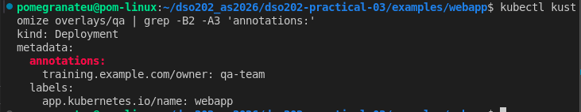

*Figure 14: The rendered QA Deployment carries `training.example.com/owner: qa-team`. The annotation was confirmed before proceeding, as the task requires.*

### Diff, apply, verify

```bash
kubectl diff -k overlays/qa || true
kubectl apply -k overlays/qa
kubectl rollout status deployment/webapp -n webapp-qa
kubectl get deployment webapp -n webapp-qa -o yaml | grep -E 'owner|environment|replicas:'
kubectl get pods -n webapp-qa -o wide
```

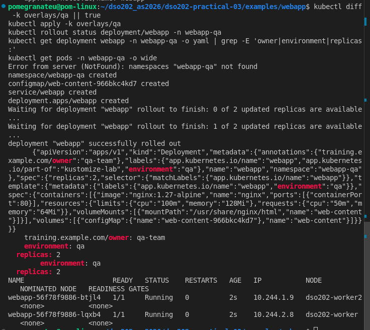

*Figure 15: The diff fails because the namespace doesn't exist yet (see Reflection). Apply creates the namespace, ConfigMap `web-content-966bkc4kd7`, Service and Deployment. The live Deployment shows the annotation, `environment: qa` and `replicas: 2`. Two pods run on separate workers.*

### Results

| Check | Result |
|---|---|
| Namespace | `webapp-qa` created |
| Generated ConfigMap | `web-content-966bkc4kd7` |
| Annotation | `training.example.com/owner: qa-team` |
| `environment` label | `qa` on Deployment metadata and pod template |
| Replicas | 2/2 available |
| Pods | `webapp-56f78f9886-btjl4` (`dso202-worker2`), `webapp-56f78f9886-lqxb4` (`dso202-worker`) |
| Resources | base values (`100m`/`128Mi` limits), confirming the prod patch did not leak |

---

## 13. Task 10 — Cleanup

```bash
kubectl delete -k examples/webapp/overlays/dev
kubectl delete -k examples/webapp/overlays/staging
kubectl delete -k examples/webapp/overlays/prod
kubectl delete -k examples/webapp/overlays/qa

kubectl get ns | grep 'webapp-' || true
```

`kubectl delete -k` renders each overlay and deletes exactly the objects it produces, including the Namespace. Deleting a Namespace also removes anything left inside it, such as the orphaned ConfigMap `web-content-fbk5dg98b8` from Task 6. The final `grep` returns no `webapp-*` namespaces once termination completes.

---

## 14. Challenge Extension — `namePrefix` in a Sandbox Overlay

### Sandbox overlay (`overlays/sandbox/kustomization.yaml`)

```yaml
apiVersion: kustomize.config.k8s.io/v1beta1
kind: Kustomization

namespace: webapp-sandbox
namePrefix: sandbox-

resources:
  - ../../base
  - namespace.yaml

labels:
  - pairs:
      environment: sandbox
    includeSelectors: false
    includeTemplates: true
```

No base resources were copied. The overlay only adds a prefix, a namespace and a label.

### Render

```bash
kubectl kustomize overlays/sandbox | grep -E '^kind:|^  name:|^  namespace:|name: .*web-content|app.kubernetes.io/name'
```

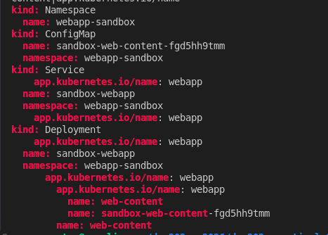

*Figure 16: Rendered sandbox overlay showing which names changed and which did not.*

### Prediction vs output

| Object / reference | Prediction | Rendered | Match |
|---|---|---|---|
| Deployment name | `sandbox-webapp` | `sandbox-webapp` | ✅ |
| Service name | `sandbox-webapp` | `sandbox-webapp` | ✅ |
| ConfigMap name | `sandbox-web-content-<hash>` | `sandbox-web-content-fgd5hh9tmm` | ✅ |
| Deployment → ConfigMap reference | rewritten to match | `sandbox-web-content-fgd5hh9tmm` | ✅ |
| `app.kubernetes.io/name` labels/selectors | unchanged | `webapp` | ✅ |
| Volume / volumeMount name | unchanged | `web-content` | ✅ |
| Namespace object | [your prediction] | `webapp-sandbox` (not prefixed) | [✅/❌] |

### Analysis — reference-aware transformation

- **Same hash as the base.** The sandbox ConfigMap's hash `fgd5hh9tmm` is identical to the base ConfigMap's hash (Figure 1). The sandbox reuses the base `index.html` unchanged, and the prefix is applied on top of the generated name. This shows the hash is determined by the content, not by the prefix or the environment.
- **References followed the rename.** The Deployment's `volumes[].configMap.name` was rewritten to `sandbox-web-content-fgd5hh9tmm`, so the pod still finds its ConfigMap.
- **The Namespace was not prefixed.** A Namespace name is itself a reference: every other object's `metadata.namespace` points to it. Renaming it to `sandbox-webapp-sandbox` would leave all other objects targeting a namespace that doesn't exist, so Kustomize deliberately skips Namespace objects for name prefixes.
- **Lookalike names were left alone.** The two unprefixed `name: web-content` lines are the **volume name** and **volumeMount name**. They are local identifiers linking a mount to a volume inside the pod, not references to Kubernetes objects, so Kustomize correctly ignored them.
- **Labels are not names.** `namePrefix` changes `metadata.name` only. `app.kubernetes.io/name: webapp` stays the same, so the Service selector still matches the pods.

The takeaway is that Kustomize is not a find-and-replace tool. It knows which fields are object references and updates them consistently, while leaving fields that only *look* similar untouched.

---

## 15. Strategic Merge Patch vs JSON 6902 Patch

| Aspect | Strategic Merge Patch (prod) | JSON 6902 Patch (qa) |
|---|---|---|
| Format | A partial Kubernetes object with only the fields to change | A list of operations (`op`, `path`, `value`) |
| Targeting | The object's own `kind` + `metadata.name` | An explicit `target:` block in `kustomization.yaml` |
| List handling | Kubernetes-aware: merges list items by key (containers by `name`) | Path- or index-based; the exact path must be known |
| Operations | Implicit merge/replace | Explicit `add`, `remove`, `replace`, `move`, `copy`, `test` |
| Readability | Looks like the manifest it modifies | Precise, but needs JSON Pointer syntax (e.g. `~1` for `/`) |
| Best for | Nested changes: resources, env, probes | Surgical edits: one annotation, removing a field, a specific list index |

In this practical, the **strategic merge patch** suited prod resources because it merged into the `nginx` container by name and kept the base `requests` (Figure 13). The **JSON 6902 patch** suited QA's annotation because it expresses one precise `add` at one path without restating any part of the Deployment (Figure 14).

---

## 16. Reflection

### A Kustomize mistake and how rendered output exposed it

When deploying QA, `kubectl diff -k overlays/qa` failed with:

```
Error from server (NotFound): namespaces "webapp-qa" not found
```

At first this looked like a mistake in my overlay. The rendered output from `kubectl kustomize overlays/qa` (Figure 14) showed otherwise. It contained a valid `Namespace` for `webapp-qa`, with the ConfigMap, Service and Deployment all correctly set to that namespace, so the overlay itself was fine. The real cause is that `kubectl diff` runs a **server-side dry run**, and the API server cannot dry-run namespaced objects into a namespace that does not yet exist. `kubectl apply -k` succeeded because it creates the Namespace first (Figure 15).

My mistake was trusting `kubectl diff` as the first check for a brand-new environment. The lesson is that `kubectl kustomize` (render) is the ground truth for what will be sent to the cluster, and `diff` becomes meaningful once the namespace exists. This is exactly why the safe workflow puts **render** before **diff**.

### Other takeaways

- Overlays keep environment differences small and reviewable. Dev versus prod is a handful of lines, not a duplicate manifest.
- The ConfigMap hash turns a content change into an automatic, traceable rollout (Figures 8–11). Plain ConfigMaps don't do that.
- Rendering before applying lets you see the new hash and rewritten reference before the cluster is touched (Figure 9).
- `apply -k` doesn't prune, so old hashed ConfigMaps pile up (Figure 11). Real clusters need pruning or namespace-level cleanup.
- `includeSelectors: false` matters because Deployment selectors are immutable.

---

## 17. Conclusion

I used Kustomize to deploy one NGINX application to four environments (dev with 1 replica, staging with 2, prod with 3, and qa with 2) from a single base, without duplicating the Deployment or Service. Namespaces, labels, replicas, a ConfigMap generator and two kinds of patches expressed every environment difference in a few small files. I verified the ConfigMap hash → rollout chain (`fbk5dg98b8` → `dm687d5ctf`, pod `669cb45656` → `765b6cd886`), confirmed that the prod strategic merge patch merged rather than replaced, built a QA overlay with a JSON 6902 patch, and showed in the challenge that `namePrefix` rewrites real references while leaving lookalike names alone. Following render → diff → apply → verify made every change predictable before it reached the cluster.